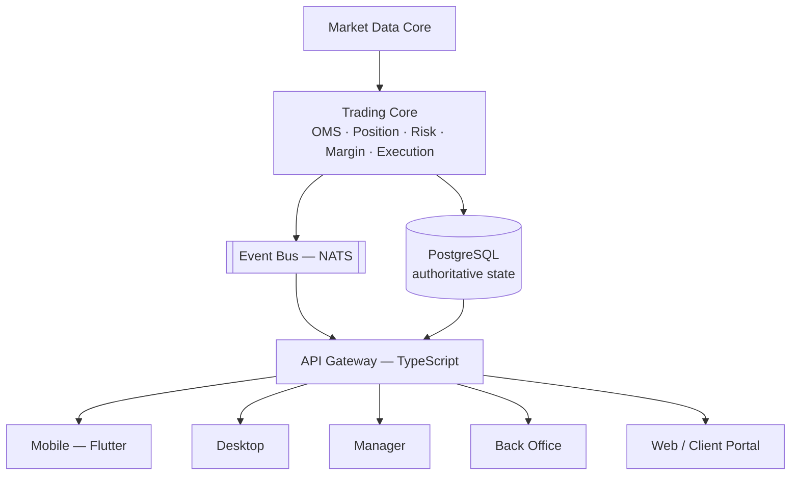
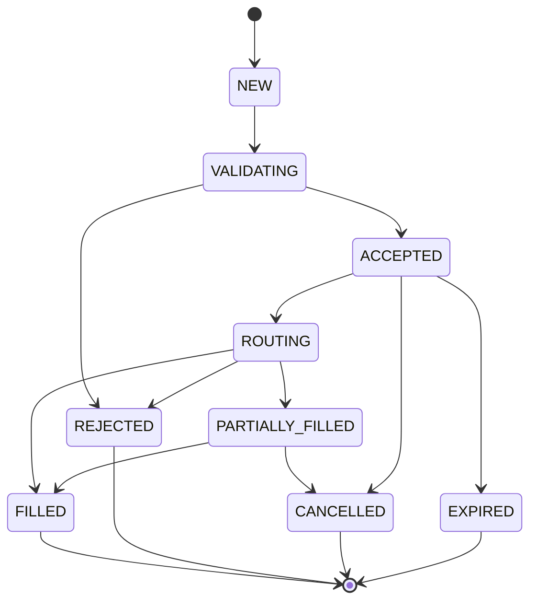

# VyXTrader — System Architecture (Phase 0)

Status: **Phase 0 complete.** §6 resolved — ADR-001 through ADR-003
accepted, see `decisions.md`. All 12 `/docs` files written (§8).

**2026-08-18 status re-check.** The user re-shared the master
architecture spec and asked directly whether the Manager app was built
against it — a fair question given `app/manage/*`'s pages have zero
visual styling, which reads as "nothing real happened here." Re-verified
against the actual code (not re-derived from this doc) rather than
assumed:

- **Confirmed still accurate, independently**: every trading-affecting
  write in `app/` — on *both* the Client (`app/api/trade/positions/
  [id]/close`) and Manager (`app/api/manage/positions/[id]/close`)
  surface, plus balance adjustment and leverage/group changes — still
  writes directly to Postgres via Prisma, with zero call into
  `engine/server` or `services/api-gateway`. This is exactly item 22-23's
  own disclosed gap ("manual/trader-initiated position close... has no
  HTTP route yet"; "no `app/api/trade/*` route reads `executionEngine`
  yet"), not a new finding — just reconfirmed from a fresh read rather
  than trusted secondhand. The Rust Core can place/cancel/modify orders
  today; nothing in production traffic reaches it yet. Intentional per
  ADR-003, not an oversight — but genuinely still open, not done.
- **RBAC gap against the spec's exact role list**: `AdminRole` has 4
  values (`SUPER_ADMIN`/`BROKER_ADMIN`/`SUPPORT`-defined-but-no-login-
  route/`MANAGER`) against the spec's 10 (`ADMIN`, `DEALER`,
  `RISK_MANAGER`, `FINANCE`, `IB_MANAGER`, `KYC_OFFICER`, `AUDITOR`
  don't exist), and there's no granular permission model — `AdminUser`
  has no permissions field, every route does a bare role-membership
  check. Recommend layering permissions onto the existing 4 roles before
  adding more named roles — real staffing doesn't need 10 people on day
  one, and permissions (not more role names) is what's actually missing.
- **What Manager already has that's real, not styling-blocked**: symbol/
  group config, positions/exposure, manual open/close, accounts,
  deposit/withdraw approval, KYC review, IB/commission (items 15-21
  below) — all live-verified against real Postgres with correct
  ledger/audit rows. The unstyled UI is a separate, disconnected problem
  from this — the logic underneath is real.
  **Closed, same day**: styled with a small new `components/ui/`
  Tailwind primitive layer + a shared `AdminShell` (see `CLAUDE.md`'s
  own entry for the full writeup, including a real session/route bug
  found and fixed along the way via `(shell)` route groups). Backend
  logic untouched throughout.
- **Scope confirmed/expanded by the user**: complete all three client
  surfaces (Desktop, WebTrader-in-broker-portal, Mobile — Mobile not
  started, Flutter, per §4/§7) for traders; Backoffice (Manager/Admin,
  `app/manage/`) for brokers; and a Super Admin app for VyXTechnologies' own
  white-label broker onboarding (register a broker's server, brand it —
  `app/(super-admin)/brokers`'s `CreateBrokerForm.tsx` already collects
  name/subdomain/tier/primary-color/logo-URL, a real start on this, not
  zero). Desktop apps for all three roles (Client, Manager, Super Admin)
  exist as Tauri shells already (`desktop-tauri/`, `manager-tauri/`,
  `admin-tauri/`) — see `decisions.md`'s manager/admin-desktop entries.

**Risk management — config + real enforcement, closed same day.** User
picked this as the top gap to close first. Real finding along the way:
building risk *config* alone would have been decorative a third time —
`Broker.maxOpenPositionsPerAccount` already existed in the schema since
migration `20260817000000_exposure_limits` but was never read by any
live route (only by the unwired Rust engine). Since neither live order
path (`app/api/trade/orders`, `app/api/manage/positions`) calls the Rust
Core at all (per this doc's own re-check above), this pass built real
enforcement on the path that actually executes trades today — new
`lib/risk.ts` (7 checks: broker trading-halt, symbol BUY_ONLY/SELL_ONLY,
lot-step, max-open-positions, symbol max-exposure, broker total-exposure,
account max-daily-loss), wired into both live routes, plus a new
`BROKER_ADMIN`-only `/manage/risk` screen and `tradingMode`/
`maxDailyLoss` fields added to the existing Symbols/Accounts screens.
Explicitly deferred, named rather than dropped: max drawdown (needs
equity-history tracking), free-margin/margin-level checks (needs an
equity calculator that doesn't exist in the live TS path — really part
of the not-yet-picked Trading-Core-routing gap), trading hours,
account-level overrides beyond symbol/broker.

Live-verified against the real local dev server, not just code review:
halted the broker and confirmed both the trader order route and
Manager's manual-open route rejected a real order, then un-halted and
confirmed both worked again; set a symbol `BUY_ONLY` and confirmed a
real SELL was rejected while BUY still filled; submitted a volume that
wasn't a valid lot-step multiple and confirmed rejection, then a valid
one filled; set `maxOpenPositionsPerAccount` to the account's real
current open-position count and confirmed the next order was rejected;
set a symbol's `maxExposure` below the account's current open volume in
that symbol and confirmed rejection; set the broker's
`totalExposureLimit` low and confirmed an order on a *different* symbol
was still correctly rejected (broker-wide, not per-symbol); seeded a
real `-500` `TRADE_PNL` `Transaction` row, set `maxDailyLoss: 100`, and
confirmed further orders were rejected; confirmed a normal unconstrained
order still succeeds after all seven checks were added (regression);
confirmed `MANAGER` gets a clean redirect on the page and `403` on the
API. All seeded test rows (5 test positions/orders, the seeded loss
transaction, every limit set during testing) were cleaned up and account
balance/broker/symbol config restored to their pre-test values afterward.

**Exposure monitor — filters, sorting, per-symbol Client P&L, closed
same day.** Spec §9's next-named gap after risk management. Pure read/
display upgrade — no schema change, no new API route; the Positions &
Exposure screen (`app/manage/(shell)/positions/`) already had the core
per-symbol BUY/SELL/NET aggregate, just none of the six filters (Symbol/
Account/Group/IB/Long-Short/Profit-Loss), no sorting, and no per-symbol
Client Floating P&L (only a broker-wide total existed). Filtering moved
client-side (same pattern `AccountsManager.tsx`'s own search box already
uses) rather than adding URL/searchParams plumbing — `page.tsx` fetches
every open position once (broadened to include each account's `group`
and `ibLinkAsClient`), `PositionsManager.tsx` computes the filtered
subset and the exposure aggregate from it via `useMemo`, so both stay in
sync as filters change. Added a `Sort by` control (`Symbol` / `Exposure`
— descending `|net|` / `Risk` — descending Client Floating P&L, on the
reading that a symbol where clients are winning the most is the
broker's biggest payout liability if closed now).

Verified by replicating the exact filter/aggregation logic in a
standalone script against real seeded data (three positions across two
accounts, one IB relationship, one group assignment, two live prices set
to force a clear profit on one position and a loss on another) rather
than eyeballing a screenshot — every one of the nine tested filter
combinations (unfiltered, each of the six filters individually, plus a
combined case) produced hand-verifiable, correct totals and per-symbol
rows. All seeded positions/orders/accounts/IB relationship/group
assignment/live prices were deleted afterward, restoring the broker to
its pre-test state.

---

## 1. Current State (what exists today, before this spec)

VyXTrader today is a single Next.js 15 monolith:

- **Web app** (`app/`, `components/`) — Next.js App Router, TypeScript,
  Tailwind. Multi-tenant: `middleware.ts` resolves a `Broker` from the
  request's Host header (subdomain or custom domain) and attaches
  `x-broker-*` headers every downstream route reads. Two separate JWT
  session systems (`lib/auth.ts` for admins, `lib/account-auth.ts` for
  traders) — httpOnly cookies, no client-held tokens.
- **Database**: PostgreSQL via Neon, accessed through Prisma (client
  library, not a service). Current models: `Broker`, `AdminUser`,
  `Account`, `KycRecord`, `Transaction`, `Symbol`, `LivePrice`, `Candle`,
  `BrokerSymbol`, `Order`, `Position`, `IbRelationship`, `AuditLog`. Money
  fields are `Decimal`, never `Float` — this rule already holds and carries
  forward unchanged.
- **Trading logic**: lives directly in Next.js API routes
  (`app/api/trade/*`) calling Prisma. `lib/trading.ts` has server-side SL/TP
  validation and P&L math. There is no separate trading-core process —
  the API route *is* the order management logic today.
- **Market data**: a real MT5 EA (`mt5-ea/`) pushes live bid/ask from a
  broker's own MT5 terminal to `/api/internal/price-feed`, written into
  `LivePrice` (latest tick) and `Candle` (OHLC aggregated at write time,
  9 timeframes: M1/M5/M30/H1/H4/D1/W1/MN1/Y1). Symbols the EA doesn't cover
  fall back to a client-side random-walk simulator
  (`lib/market-simulator.ts`). This is explicitly a Phase-5-stopgap by
  design, already documented as such in the existing codebase.
- **Desktop**: a **Tauri** (Rust + React/TypeScript) app (`desktop-tauri/`)
  — per ADR-001, the sole desktop shell now (an earlier Electron app,
  `desktop/`, was built first, reached full parity comparison, then was
  removed once Tauri matched it feature-for-feature and was confirmed to
  have no real installed users — see ADR-001's update log in
  `decisions.md`). Frameless custom title bar, system tray, native
  notifications, auto-update via a signed feed, per-broker rebranding via
  `broker.config.json` + an icon swap. It loads the same web app's pages
  in a native window; it does not embed any trading logic
  of its own.
- **Mobile, Manager app, Back Office**: do not exist yet. The current
  Super Admin (`app/(super-admin)`) covers a thin slice of what "Manager"
  and "Back Office" describe below (broker creation, admin login) — Phase 3
  in the existing roadmap (KYC review, real deposit/withdraw, IB
  commission) was never started.
- **Root-domain launcher** (`app/launch`): an MT5-style "pick your server,
  log in" screen added this engagement, using a real cross-site
  `<form method="POST">` submit so a password never has to travel through
  a URL, landing on `/api/trade/login-redirect` on the picked broker's own
  subdomain (so the session cookie ends up scoped correctly).

None of this is "wrong" — it was built deliberately as a fast-moving MVP.
The question this document has to answer is how much of it survives as-is,
how much gets wrapped by a new authoritative Trading Core, and how much
gets replaced outright — see §6.

---

## 2. Target State (per this spec)

A single authoritative **Trading Core** (Rust) that Order Management,
Position, Risk, Margin, and Execution all live inside, with every other
surface (Desktop, Mobile, Manager, Back Office, Web) as a client of it —
never re-implementing trading decisions locally.



Redis sits beside this for cache/session/rate-limiting only — never as the
authoritative financial store. NATS carries internal events (order
updates, position changes, price ticks) from the Trading Core out to the
Gateway, which fans them out over WebSocket to connected clients.

---

## 3. Monorepo Structure

Adapting the spec's suggested layout to what already exists (moving files,
not rewriting them, wherever the current code already does the job):

```
/apps
  /web            ← current app/ + components/ (Next.js) — becomes the
                     Client Portal + Super Admin, minus trading logic
                     once that moves into the Trading Core
  /manager        ← new — broker/dealing/risk/ops tool (spec §17)
  /backoffice     ← new — CRM/KYC/finance/reporting (spec §18)
  /desktop        ← current desktop-tauri/ (Tauri) — see ADR-001;
                     the earlier Electron app has been removed
  /mobile         ← new — Flutter (spec §16)

/engine           ← NEW — the Rust Trading Core
  /market-data
  /order-management
  /position
  /risk
  /margin
  /execution
  /ledger

/services         ← TypeScript, non-latency-critical
  /api-gateway    ← REST + WebSocket fan-out, auth, RBAC enforcement
  /notification-service

/libs
  /protocol       ← shared event/message schemas (Rust + TS codegen)
  /instrument     ← symbol specification registry
  /config
  /security

/prisma           ← current prisma/ — becomes the Postgres schema owner
                     for account/config/audit data; the Trading Core's
                     own tables (orders, positions, ledger) are proposed
                     to live in the same Postgres instance but written
                     only by the Rust engine (see §6 Decision 2)

/mt5-ea           ← unchanged — still the price-feed bridge into
                     Market Data Core, same role it has today

/docs             ← this folder
/tests
/infrastructure
  /docker
  /kubernetes     ← added only once scale actually requires it, per spec
```

---

## 4. Tech Stack Decisions

| Layer | Technology | Status |
|---|---|---|
| Trading Core (OMS/Risk/Position/Margin/Execution/Ledger) | Rust | New — does not exist today |
| Market Data Core | Rust | New — replaces/absorbs the current TS price-feed ingest logic |
| API Gateway | TypeScript/Node.js | New — the current Next.js API routes play this role today; gets extracted |
| Web (Client Portal, Super Admin) | Next.js + TypeScript | Already exists, keeps this role |
| Desktop | Tauri (new, for Phase 4 Trading Core workstation) | Accepted — ADR-001, see `decisions.md` |
| Mobile | Flutter + Dart | New — does not exist today |
| Manager | Next.js + TypeScript | New — does not exist today |
| Back Office | Next.js + TypeScript | New — Phase 3 of the old roadmap never started this |
| Database | PostgreSQL | Already in place (Neon) |
| Cache/session | Redis | New — sessions are currently httpOnly JWT cookies with no server-side session store; Redis would add revocable sessions and rate-limiting |
| Internal messaging | NATS | New — no event bus exists today; price updates and order state changes currently just re-render via polling/direct Prisma reads |

---

## 5. Order State Machine (target)



This is a superset of the current schema's `OrderStatus` enum
(`PENDING → ACCEPTED → FILLED/REJECTED/CANCELLED`) — `NEW`/`VALIDATING`/
`ROUTING`/`PARTIALLY_FILLED` are new states the Rust core introduces that
the current Next.js-based OMS doesn't distinguish today (it currently
treats "accepted" and "filled" as effectively the same instant for MARKET
orders, per the existing codebase's own documented simplification: "MARKET
orders trust the client-supplied execution price until Phase 5's real
matching engine exists").

---

## 6. Decisions Requiring Approval

Per the project's own rule: *"If you identify a better technology or
architecture than something specified above, DO NOT silently change it.
Explain the alternative, its advantages/disadvantages, and wait for
approval before changing a core architectural decision."* All three below
were flagged, then resolved per explicit direction to follow the spec as
written. Full status/rationale lives in `decisions.md` (ADR-001 through
ADR-003); this section keeps the original context/options for reference.

### Decision 1 — Desktop shell: keep Electron, or migrate to Tauri?

**Resolved: Tauri (ADR-001), and now fully executed.** The spec's default
is Tauri ("Do NOT use Electron unless there is a specific documented
requirement that Tauri cannot satisfy"), and that's the call for the
Phase 4 Trading Core desktop workstation. An Electron app was built
first (frameless custom title bar, system tray with minimize-to-tray,
native OS notifications, `electron-updater` wired to a real update feed,
per-broker rebranding via `broker.config.json` + `rebrand.js`) and kept
running while the Tauri app was built out to match it feature-for-feature.
Once Tauri reached full parity and it was confirmed the Electron app had
never had any real installed users (testing-only), the Electron app
(`desktop/`) was removed entirely — Tauri (`desktop-tauri/`) is now the
only desktop shell.

| | Electron (removed) | Tauri (current) |
|---|---|---|
| Status | Built, tested, then removed once Tauri reached parity | Built, tested, live |
| Binary size | ~80MB installer | Typically 3-10MB (uses the OS's native webview) |
| Memory footprint | Higher (bundles Chromium) | Lower (no bundled browser engine) |
| Backend language | Node.js (JS/TS) | Rust — shares code/types directly with the Trading Core |
| Ecosystem/maturity | Very mature, huge community | Newer, smaller but growing fast, backed seriously |

Full migration/cutover history lives in `deployment.md` and
`decisions.md` ADR-001.

### Decision 2 — Where does the Rust Trading Core's data live, and how does today's Prisma-owned data migrate?

**Resolved: option (a) below (ADR-002).**

Two shapes are possible:

**(a) Same Postgres instance, new tables, Rust-owned.** The Trading Core
gets its own tables (`orders`, `positions`, `ledger_entries`, etc.) in the
same Neon Postgres database, written only by the Rust engine. Next.js
stops writing `Order`/`Position`/`Transaction` directly — those become
read-only projections the API Gateway queries, or the Gateway calls into
the Trading Core over its API instead of touching Postgres for trading
data at all. Prisma keeps owning `Broker`/`AdminUser`/`Account`/`KycRecord`/
`Symbol`/`BrokerSymbol`/`IbRelationship`/`AuditLog` — the non-trading,
config/CRM-shaped data — since that's arguably not latency-critical and
fits Prisma/TypeScript fine per the spec's own guidance (§1: TypeScript
for "non-latency-critical business logic").

**(b) Separate database entirely**, with the Trading Core's Postgres
instance independent of the current Neon database, synchronized via
events (NATS) for anything the web app needs to display.

(a) is one Postgres instance, clear table ownership boundary — no
cross-database consistency problem to solve, and nothing about today's
scale needs database-level isolation. The spec's own §16 ("PostgreSQL is
the authoritative source... Never make Redis the authoritative financial
database") reads as one authoritative Postgres, not several, which (a)
already matches without deviation.

Existing demo data (the seeded `AcmeFX`/`Nova Markets` brokers, their demo
accounts and any positions opened during this engagement's testing) would
need a one-time migration script once the Rust `orders`/`positions`/
`ledger_entries` tables exist, translating current `Order`/`Position`/
`Transaction` rows into the new shape. Given this is pre-production demo
data, the simplest honest option is likely "re-seed rather than migrate" —
flagging rather than assuming, since that's a data-loss-adjacent call.

### Decision 3 — How much of the current Next.js trading logic is kept running during the Rust core's build-out?

**Resolved: keep the current path live (ADR-003).** The spec's Phase 1-2
order (Rust workspace → Trading Core with extensive tests) implies a
period where the Rust core exists but isn't finished. During that window,
the *current* Next.js/Prisma order placement (`app/api/trade/orders`,
`lib/trading.ts`) keeps running as the live system unmodified, while the
Rust core is built in parallel behind its own milestone gates (matching
the spec's own Phase 1-2 ordering). Cut over broker-by-broker once the
Rust core passes its own test/benchmark gates (spec §21, §29's
"Definition of Done"). This matches the "never destroy existing working
functionality" rule and the spec's own instruction not to rewrite the
whole project without explicit instruction — no deviation from the spec
here, just the option the spec itself already pointed at.

---

## 7. How This Maps to the Spec's Own Phases

| Spec Phase | Maps to |
|---|---|
| Phase 0 — Architecture | This document + the 11 siblings in `/docs` (in progress) |
| Phase 1 — Core Foundation | New: Rust workspace, Postgres/Redis/NATS wiring, API Gateway extraction, auth rework |
| Phase 2 — Trading Core | New: the actual OMS/Risk/Margin/Position/Ledger Rust modules |
| Phase 3 — Market Data | Extends the existing MT5 EA bridge + candle aggregation, moved into Rust |
| Phase 4 — Desktop | Tauri app per ADR-001 — done, at full Electron parity; the earlier Electron app has been removed |
| Phase 5 — Mobile | New, not started |
| Phase 6 — Manager | All originally-planned Phase 3/6 backoffice depth now live: symbol/spread config, positions/exposure dashboard, manual position open/close, groups/accounts, deposit/withdraw approval, KYC review, and IB/commission (`app/manage/`) — see `authentication.md` §3 and this doc's log below. |
| Phase 7 — Back Office | New, not started |
| Phase 8 — Advanced | New, not started |

---

## 8. Immediate Next Steps

1. ~~Resolve Decisions 1-3 above.~~ Done — see `decisions.md` (ADR-001
   through ADR-003).
2. ~~Write the remaining `/docs` files~~ Done: `trading-engine.md`,
   `risk-engine.md`, `execution.md`, `market-data.md`, `database.md`,
   `api.md`, `authentication.md`, `security.md`, `deployment.md`,
   `testing.md`, `decisions.md` all exist alongside this file.
3. Phase 1 (Rust workspace scaffold) — done: `/engine` exists with all
   8 module crates (`protocol`, `market-data`, `order-management`,
   `position`, `risk`, `margin`, `execution`, `ledger`). Pure-function
   logic with no I/O dependency is implemented and unit-tested (16 tests,
   0 failures): state-machine legality, the margin formula, margin-call/
   stop-out evaluation, candle bucketing, internal-strategy fill pricing.
   See `/engine/README.md`.
4. Phase 2 (Trading Core) — first slice done: Postgres schema for the
   Rust-owned tables (`engine/migrations/`, per ADR-002 — applied to the
   live database), a `sqlx`-based persistence layer in
   `order-management::db`, a real `place_market_order` orchestration
   function wiring OMS -> Risk -> Execution -> Position in one
   transaction (matching the sequence diagram in `trading-engine.md` §2),
   and NATS event publishing (`order-management::events`) after each
   commit.
5. Phase 2 continued — API Gateway skeleton: `engine/server` is a new
   Rust binary (`trading-core-server`, Axum) exposing
   `POST /v1/orders/market` over HTTP, wired to `place_market_order`; this
   is what makes the Trading Core an actual running service instead of a
   library nothing calls. `services/api-gateway` is a new standalone
   TypeScript service (own `package.json`, doesn't touch the root Next.js
   app) that verifies the existing trader JWT session
   (`vyx_trade_session`, same secret as `lib/account-auth.ts`) and
   forwards authenticated order requests to `trading-core-server`. Both
   verified locally: the Rust server builds clean, the Gateway
   type-checks, builds, and its health/auth-rejection behavior was
   smoke-tested end to end.

6. Phase 2 continued — closed the "trusts the client" gap: the Gateway
   now fetches Account (balance/credit/leverage/status), Symbol
   (contractSize), and LivePrice itself via a read-only `pg` client
   (`services/api-gateway/src/db.ts` — plain SQL, not Prisma Client,
   since sharing a generated Prisma client across two independently
   -installed npm packages needs monorepo/workspace tooling this project
   doesn't have; that would mean touching the root `package.json`, out of
   scope for closing this specific gap) and computes used margin from the
   account's open Rust-owned positions. A client can now only specify
   *which* order to place, never fake its own balance/margin/price.
   Money math uses `decimal.js` throughout, matching the project's
   Decimal-only rule.

7. Phase 2 continued — equity now includes floating P&L: `getOpenPositionsSummary`
   (`services/api-gateway/src/db.ts`) computes both used margin and
   unrealized P&L for the account's open Rust-owned positions in one
   query (LEFT JOIN on `LivePrice` so a position with no current tick
   still counts toward margin, just not toward P&L — silently dropping it
   would understate risk). Formula matches `lib/trading.ts`'s
   `computeRealizedPnl` exactly. `equity = balance + credit + floatingPnl`.

8. Phase 2 continued — margin monitor implemented:
   `order_management::monitor` polls every account with an open position
   on an interval (`MARGIN_MONITOR_INTERVAL_SECS`, default 5s — not
   literally tick-driven yet, since no running Rust market-data ingest
   service exists to trigger it off real ticks; polling is the honest
   interim substitute, see `market-data.md`'s implementation status),
   computes equity/used margin the same way the order-placement path
   does, and calls `margin::evaluate`. On margin call it publishes a
   `margin.call` NATS event. On stop-out it force-closes the account's
   worst (most negative floating P&L) closeable position, records the
   realized P&L as a `ledger_entries` row, and repeats until the account
   is back above the stop-out threshold or runs out of closeable
   positions — bounded by the account's own open-position count, so it
   can't loop unboundedly. Spawned as a background task alongside the
   Axum server in `engine/server`.

   **Resolved a real ownership question along the way:** `Account.balance`
   is Prisma-owned (ADR-002) and this crate never writes it, but
   force-closing a position realizes P&L that has to count toward the
   account's true balance somehow. Resolution: `ledger_entries` (already
   Rust-owned) is the delta trail — "effective balance" = `Account.balance
   + SUM(ledger_entries.amount)`. Both the monitor and
   `services/api-gateway` (order placement's equity calc) now compute it
   this way identically, so nobody has to cross the ownership boundary to
   write a number the other side already owns.

9. Phase 1 item closed — Redis-backed sessions: trader sessions
   (`lib/account-auth.ts`) are now Redis-backed opaque tokens instead of
   self-contained JWTs, so logout (`app/api/trade/logout`) actually
   revokes the session immediately rather than only clearing a cookie
   whose JWT would otherwise stay valid until its own expiry. Login-attempt
   rate limiting (`lib/rate-limit.ts`) added to both login routes. This
   *does* touch the live Next.js login/logout routes (`trade/login`,
   `trade/login-redirect`, `trade/logout`) — done carefully, verified with
   a full type-check of the whole app (0 errors) plus functional tests
   against a local Redis-compatible server (Memurai) before considering it
   done. `services/api-gateway` reads the same Redis session convention.
   Admin sessions (`lib/auth.ts`) are unchanged — out of scope here.

   Nothing else open from the original Phase 1/2 gap list. The existing
   Next.js trading path is untouched throughout, per ADR-003.

10. **Phase 3 (Market Data) — first slice done:** the Rust ingest path
    (`engine/market-data::db`/`::ingest`) ports `lib/price-feed.ts`'s
    `LivePrice`/`Candle` upsert SQL unchanged (same `ON CONFLICT ...
    GREATEST/LEAST` bucket-widening), reusing the already-tested pure
    bucketing logic from Phase 1. `engine/server` exposes it as
    `POST /internal/price-feed` (header-secret auth, same
    `PRICE_FEED_SECRET` value as the Next.js side). `lib/price-feed.ts`
    now forwards to that route (`TRADING_CORE_URL`) instead of writing
    Prisma directly — Market Data Core is the sole writer of
    `LivePrice`/`Candle` in practice now, not just by documented intent
    (`market-data.md` §3). Each ingested tick also publishes to NATS on
    `price.tick.{symbol}`. The MT5 EA itself is untouched — Next.js stays
    a thin proxy in front of the Rust route rather than the EA being
    repointed directly, so there's no live-broker disruption; a direct
    EA→Rust cutover is a deliberately separate later step. See
    `market-data.md` §5 for the full implementation-status writeup,
    including the WebSocket fan-out (`services/api-gateway/src/ws.ts`)
    that replaced part of `WebTrader.tsx`'s client-side price polling
    with a push.

11. **Margin monitor made tick-driven**, same-day follow-up to #10:
    `order_management::monitor` now reacts to the `price.tick.*` stream
    #10 added, not just its polling timer (kept as a quiet-period safety
    net). Adding a second concurrent trigger source exposed and fixed a
    real double-close race in `close_position_with_ledger_entry` (no
    `WHERE status = 'OPEN'` guard on the force-close `UPDATE`) — now
    idempotent. Verified live end to end, including replaying the same
    stop-out-triggering tick to confirm no duplicate close/ledger entry.
    See `market-data.md` §5.

12. **Execution now reads its own live price**, closing the last item
    `execution.md` §4 had flagged from Phase 2's original skeleton:
    `place_market_order` fetches the current tick itself from Market
    Data Core instead of trusting a `current_tick` the API Gateway
    supplied in the request. `PlaceMarketOrderRequest` had the field
    removed outright (not just unused), and the Gateway's matching
    `getLivePrice` read was deleted as dead code. Verified live: a fill
    at the correct seeded price with zero price data in the request
    payload, a clean rejection for a symbol with no live price, and
    confirmation the pre-existing free-margin rejection still fires
    correctly with the reordered checks. See `execution.md` §5.

13. **Per-position SL/TP is now actually enforced** — a gap found while
    auditing for exactly this class of issue, not something either this
    doc or `risk-engine.md` had previously flagged as deferred. Until
    now, nothing server-side ever closed a position when price reached
    the trader's own stop-loss/take-profit; only unrelated margin-ratio
    stop-out could force-close anything. `order_management::monitor`
    checks every open position's SL/TP against the current tick before
    its margin-level check, closing any that crossed and publishing
    `position.stop_loss_hit`/`position.take_profit_hit`. Verified live: a
    BUY's SL and a SELL's TP both triggered correctly on the same tick
    with correct realized P&L, and the tick-driven trigger confirmed to
    actually fire within about a second (not just the polling-timer
    fallback masking it, which a too-tight first timing test briefly
    misidentified as a bug before a longer wait disproved it). See
    `risk-engine.md` §5.

14. **LIMIT/STOP orders**, closing `execution.md` §2.1 step 3 — the last
    unimplemented step in Execution's own documented design.
    `place_pending_order` accepts a LIMIT/STOP order with no margin
    reserved while it waits (only placement-time price-side validation);
    a new `order-management::pending_orders` module, driven by the same
    `price.tick.*` subscription the margin monitor uses (now fanned out
    to both concurrently from one subscription, not two), checks the
    real margin requirement only when the order actually triggers —
    matching `place_market_order`'s check exactly — and fills or rejects
    accordingly. Reuses the stop-out/SL-TP idempotent-claim pattern
    (`try_claim_order_for_routing`) for the same double-trigger
    protection. `POST /v1/orders/pending` added to both `engine/server`
    and the Gateway. Verified live: placement-time price-side rejection,
    trigger-time fill at the correct price opening a real position, and
    trigger-time margin rejection for a deliberately oversized order that
    placement let through (proving the margin check truly defers to
    trigger time). See `execution.md` §5.

15. **Phase 6 (Manager) — first screen: symbol/spread config.** Closes a
    real, standing gap: `BrokerSymbol`'s pricing/risk fields
    (`spreadMarkup`, lot limits, swap, `commissionPerLot`, `maxExposure`)
    had zero admin UI — direct DB edit only, even though the Rust engine
    had been reading and enforcing all of them for several slices already.
    New `app/manage/` route group, modeled on MT5's own Manager terminal
    Symbols tab (one grid, one row per symbol, per-row save) per the
    user's explicit request. Lives on the broker's own subdomain, not a
    new `manager.<ROOT_DOMAIN>` subdomain — a deliberate, confirmed
    deviation from this doc's own §3 target framing, since the
    `/apps/*` monorepo split hasn't happened and would've been unrelated
    setup work for one screen. New `MANAGER` role under the existing
    admin-session system (not a new one), plus a `getAdminSession()`
    hardening (broker-scoped sessions now cross-check `x-broker-id`) that
    benefits every broker-scoped admin role, not just this one. See
    `authentication.md` §3 for the full writeup and live verification.

16. **Phase 6 (Manager) — second screen: positions/exposure dashboard.**
    `app/manage/positions/page.tsx`. Two views: net exposure per symbol
    (buy volume − sell volume — what a dealing desk actually watches, not
    raw position count) and a full open-positions list with live floating
    P&L, both broker-scoped off the same `getAdminSession()` guard as the
    symbols screen. Reads Prisma's `Position` table, not the Rust-owned
    `positions` table — per ADR-003 no broker has cut over to the Rust
    engine yet, so Prisma's table is where real trading data actually
    lives today (same table the trader-facing view already reads);
    revisit once a broker cuts over. Found and worked around a real
    schema gap along the way — see `database.md` §6 (`DateTime` columns
    aren't timezone-aware, flagged there rather than fixed schema-wide).
    Verified live: exposure aggregation and floating P&L both hand-checked
    against seeded positions with known open prices and a known current
    price, correct in both directions (BUY/SELL); pre-existing real demo
    positions from earlier manual testing rendered correctly alongside
    the seeded ones, confirming this isn't only correct against synthetic
    data.

17. **Phase 6 (Manager) — third feature: manual position open/close.**
    `app/api/manage/positions/route.ts` (open) and
    `app/api/manage/positions/[id]/close/route.ts` (close), UI in
    `PositionsManager.tsx`. The user's own first word for the close
    action was "delete" — clarified against `CLAUDE.md`'s own
    non-negotiable rule ("never delete executed trades... corrections
    are compensating entries") before writing any code: this is a state
    transition (OPEN → CLOSED, same state machine as every other close),
    never a row deletion. First real usage of two things the schema
    already anticipated but nothing wrote: `Position.closedByAdminId`
    and the `"MANUAL_POSITION_CLOSE"` `AuditLog` action (both existed as
    schema fields/doc-comment conventions with zero application code
    using them until now). Mirrors the trader-initiated close route's
    exact money-math ($transaction reads `Account.balance`, computes
    `balanceAfter` explicitly rather than `increment`, writes a
    `TRADE_PNL` `Transaction` row) — same correctness, admin-scoped
    instead of trader-owned, plus the new `closedByAdminId`/`AuditLog`
    writes. Confirmed with the user: price for both open and close comes
    from `LivePrice` automatically (same 15s freshness rule as
    `database.md` §6, factored into a shared `lib/live-price.ts` used by
    this feature and the positions dashboard both) rather than an
    admin-typed value, since a wrong manually-entered price would
    mis-book a real account's balance. No margin check on manual open —
    matches the existing trader-facing MARKET order route's own current
    baseline (confirmed via code search: no margin check exists there
    either), not a new gap introduced by this feature.

    Verified live end to end against a real Postgres: opened a BUY
    position, confirmed the correct ask-price fill and a
    `MANUAL_POSITION_OPEN` audit row; partial-closed 0.4 of 1.0 lots at a
    known bid, confirmed the exact expected realized P&L, an exact
    matching `Account.balance` delta, the position staying `OPEN` at the
    reduced volume, and a `TRADE_PNL` `Transaction` row with correct
    `balanceBefore`/`balanceAfter`; the staleness rule fired for real
    (not just as a manufactured test) when enough wall-clock time passed
    between steps, rejecting the follow-up close attempt with "no live
    price" until the price was refreshed — then closed the remaining 0.6
    lots fully, confirmed `status: CLOSED`, `closedByAdminId` set to the
    acting admin, and the second `MANUAL_POSITION_CLOSE` audit row.
    Confirmed broker-scoping: opening a position against a different
    broker's account with this session was cleanly rejected
    ("account not found"), not permitted or leaked across tenants.

18. **Phase 6 (Manager) — fourth/fifth features: Groups + Accounts.**
    `Group` is a brand-new model (`prisma/migrations/20260817050000_groups`)
    — the first real answer to `risk-engine.md` §4's open question
    ("whether margin-call/stop-out thresholds are broker-level config...
    needs its own migration when this is actually built"). Deliberately
    scoped narrower than full settings-inheritance: assigning an account
    to a group copies the group's `leverage` onto `Account.leverage`
    once, at assignment time, rather than making the Rust engine's
    order-placement hot path (`get_account_funds` in
    `engine/order-management/src/db.rs`) resolve an account's effective
    leverage through its group live — that would mean changing the
    trading engine in the same change as adding two admin screens.
    `marginCallLevel`/`stopOutLevel` are stored/shown, not yet read by
    `engine/margin`'s (still-hardcoded, still not wired to a live
    monitor loop) `MarginThresholds` — flagged in `risk-engine.md`, not
    hidden. First real usage of three more previously-aspirational
    `AuditLog` action strings: `"BALANCE_ADJUSTMENT"`, `"LEVERAGE_CHANGE"`,
    and `TransactionType.ADJUSTMENT` (all existed as schema enum values/
    doc-comment conventions with zero application code before this,
    same pattern as `MANUAL_POSITION_CLOSE` before the previous slice).

    New permission split, read directly from `AdminRole.MANAGER`'s own
    schema comment ("narrower than BROKER_ADMIN... not KYC/finance"):
    balance adjustment and direct leverage edits require `BROKER_ADMIN`;
    group CRUD and assigning an account to a group stay open to
    `MANAGER` too, same category as the symbols screen. This is the
    first Manager route to enforce a permission difference *between*
    the two roles rather than gating both identically.

    Verified live against a real Postgres, both seeded roles
    (`manager@acmefx.com` / `admin@acmefx.com`): created a group with a
    distinct leverage as `MANAGER` (allowed); assigned an account to it
    as `MANAGER`, confirmed `Account.leverage` actually changed to the
    group's value and an `"ACCOUNT_GROUP_CHANGED"` audit row exists;
    confirmed `MANAGER` gets a clean 403 attempting a direct leverage
    edit or a balance adjustment on the same account; confirmed
    `BROKER_ADMIN` can do both — leverage edit applied correctly,
    balance adjustment produced an exact `balanceBefore`/`balanceAfter`
    matching the requested amount with a real `Transaction` row and
    `"BALANCE_ADJUSTMENT"` audit row; confirmed broker-scoping (a
    different broker's account was cleanly rejected, not leaked).

19. **Phase 3/6 — deposit/withdraw requests.** Closes `CLAUDE.md`'s own
    flagged gap: WebTrader's funds modal (Deposit/Withdraw tabs, amount
    input — already fully built) previously ended in a stub toast
    ("goes through the backoffice review flow (Phase 3) — not yet
    available"). That stub text described the exact design the schema
    already had fields for: `Transaction.type` has `DEPOSIT`/
    `WITHDRAWAL`, `Transaction.status` **defaults to `PENDING`** — but
    nothing in the codebase created a `PENDING` transaction or resolved
    one to `COMPLETED`/`REJECTED`, confirmed via full-repo search.
    Modeled as a state-machine transition on the existing `Transaction`
    row (`PENDING → COMPLETED`/`REJECTED`), not a new model — mirrors
    the `Order`/`Position` convention of a non-terminal row with
    placeholder values finalized on transition. New
    `Transaction.reviewedByAdminId` (mirrors `KycRecord.reviewedByAdminId`)
    and `updatedAt` (this is the first `Transaction` field to ever
    change after creation — every other type has always been
    create-once-`COMPLETED`). Balance only ever moves on approval, never
    at submission. A withdrawal is checked against the account's balance
    twice — once at request time, again at approval time (trading
    activity in between can invalidate a request that fit when
    submitted) — approving a now-unaffordable withdrawal is refused
    rather than allowed to push balance negative. Approval/rejection is
    `BROKER_ADMIN`-only (`app/manage/funds`), same finance carve-out as
    balance adjustment/leverage edits — this whole screen redirects
    `MANAGER` sessions outright rather than just hiding controls, since
    every action on it is finance.

    Verified live end to end against a real Postgres (trader session via
    Redis — Memurai was already running as a local Windows service,
    just needed `REDIS_URL` pointed at it): submitted a deposit and a
    within-balance withdrawal as a trader, confirmed both `PENDING` with
    `balanceBefore == balanceAfter == currentBalance`; confirmed a
    withdrawal request for more than the balance was refused at
    submission; approved the deposit as `BROKER_ADMIN`, confirmed
    `Account.balance` increased by exactly the requested amount with a
    correct `Transaction`/`AuditLog` pair; deliberately dropped the
    account's balance below the pending withdrawal's amount (simulating
    trading losses since the request) and confirmed approval was
    correctly refused with no partial state (`$transaction` rollback
    verified: the row stayed `PENDING`, balance stayed untouched); then
    rejected that same withdrawal cleanly; confirmed `MANAGER` gets 403
    on the list/approve API *and* a redirect on the page itself; confirmed
    broker-scoping (a different broker's request was cleanly rejected).

20. **Phase 3/6 — KYC review, closing out the last item.** Unlike every
    prior Manager-app slice, there was no existing trader-facing UI stub
    to wire up (WebTrader had zero KYC/Identity/Verify references) — both
    the trader submission modal and the admin review screen are new.
    First real file-upload route in the codebase (`@vercel/blob`, newly
    added dependency) — user explicitly wanted real upload buttons
    (front/back ID photos), not a pasted-URL placeholder. Documents are
    stored with `access: "private"` (not the more common "public" Blob
    access) since these are ID-document PII: the only way to ever read
    one back is a server-side `get()` call holding
    `BLOB_READ_WRITE_TOKEN`, so there's no raw, fetchable URL to leak in
    the first place, even to another authenticated admin. The admin
    review screen never renders a Blob URL directly — every document
    view goes through `app/api/manage/kyc-requests/[id]/document`, which
    checks admin auth + broker-match, then proxies the stream back (the
    browser's network tab only ever shows this app's own domain).
    `KycRecord.documentUrl` renamed to `documentFrontUrl` + new
    `documentBackUrl` (zero existing rows, safe rename — nothing had
    ever created a `KycRecord` before this). Resubmission is allowed
    over a `REJECTED` record, refused (409, before ever touching Blob)
    over a `PENDING`/`APPROVED` one.

    **Known, disclosed limitation:** this sandbox has no
    `BLOB_READ_WRITE_TOKEN` connected, so the actual upload-to-Blob and
    read-from-Blob calls could not be exercised end-to-end here — set
    that env var (a real Vercel Blob store) before this is live for
    real. Verified live instead: seeded a `PENDING` `KycRecord` directly
    (bypassing the unavailable upload step) and exercised the full
    review state machine for real — approve and reject both set
    `status`/`reviewedByAdminId`/`reviewedAt`(/`rejectionReason`)
    correctly with matching `AuditLog` rows; confirmed broker-scoping
    (a different broker's record was cleanly rejected, not leaked,
    both for approval and for the list endpoint); confirmed the
    trader-facing resubmission guard actually returns before calling
    Blob at all (a resubmission attempt against an `APPROVED` record
    returned a clean 409, not a crash, proving the guard runs first);
    confirmed the missing-token failure mode is graceful everywhere
    it can be hit (both the upload route and the document-proxy route
    return a clean 503 rather than an unhandled exception when
    `BLOB_READ_WRITE_TOKEN` is absent — the document-proxy route
    initially threw a raw 500 here during testing, fixed to match the
    same pre-check pattern the upload route already had).

21. **Phase 3/6 — IB/commission, closing out Phase 3 entirely.** Unlike
    every other Phase 3/6 slice, `IbRelationship` (broker → IB account →
    client account, `commissionType`, `commissionRate`) already existed
    in the schema since the very first migration, but nothing had ever
    created a row or written a commission `Transaction` for one — no
    trader-facing stub, no spec text anywhere (`TransactionType.COMMISSION`
    was already used, but only by the Rust engine for the *trading*
    commission charged to a client on position open, a separate concern
    from an IB's payout cut). Only one schema addition:
    `IbRelationship.lastPayoutAt` (null = never paid). Deliberately no
    accrual/ledger table — pending commission is computed on read from
    `CLOSED` `Position` rows on the client account with `closedAt` after
    `lastPayoutAt` (`lib/commission.ts`): `PER_LOT` is `rate × Σvolume`;
    `PERCENTAGE` is `rate% × Σ(Position.commission)`, i.e. the IB's cut
    of the broker's own trading-commission revenue on those trades — a
    standard revenue-share basis, but an assumption on my part since no
    spec exists to confirm it. Payout (`BROKER_ADMIN` only, `PATCH
    .../[id] {action:"PAY"}`) recomputes the pending amount server-side
    inside the same `$transaction` that moves it (never trusts a
    client-supplied figure — a position can close between page render
    and the "Pay" click), same balanceBefore/balanceAfter-never-increment
    pattern as every other ledger write this session.

    **DB migration-history gap found during verification.** The live
    connection provided for this slice (`db.prisma.io`, not the
    `ep-*.neon.tech` host `CLAUDE.md` still describes) turned out to be
    a real but far-behind database — `_prisma_migrations` stopped at
    `20260812234500_extended_timeframes`, missing every migration from
    the rest of this session (`exposure_limits`, `commission_per_lot`,
    `manager_role`, `timestamptz`, `groups`, `transaction_review`,
    `kyc_front_back`) plus the one this slice adds. Caught immediately
    because seeding a `MANAGER` admin for the permission-boundary test
    failed with `invalid input value for enum "AdminRole": "MANAGER"` —
    an enum value that another migration was supposed to have already
    added. Applied all seven missing migrations' existing SQL files (in
    filename order, each in its own transaction, each recorded into
    `_prisma_migrations`) to bring the database fully in line with
    `schema.prisma`; `prisma migrate status` confirmed "Database schema
    is up to date" afterward, and every other `/manage/*` screen was
    spot-checked (200 OK) post-catch-up to confirm nothing else broke.
    This DB is now the one this feature (and presumably future ones)
    should keep using.

    Verified live: created both a `PER_LOT` (rate $5/lot × 1.50 lots
    closed → `7.5000`) and a `PERCENTAGE` (rate 25% × $100 broker
    commission revenue → `25.0000`) relationship against seeded
    `CLOSED` `Position` rows, confirming the listed `pendingCommission`
    matched the hand-calculated value for both formulas; paid the
    `PER_LOT` one and confirmed `Account.balance` (`1000 → 1007.5000`),
    the `COMMISSION` `Transaction` (`balanceBefore`/`balanceAfter`,
    `referenceType: "IbRelationship"`), the `IB_COMMISSION_PAID`
    `AuditLog` row, and `lastPayoutAt` all landed correctly, and that
    `pendingCommission` recomputed to `0.0000` immediately after (only
    positions closed after the new `lastPayoutAt` would count); a
    second broker's `BROKER_ADMIN` got an empty list and a clean 404 on
    both the relationship's id and a `PAY` attempt against it; `MANAGER`
    got a clean 403; a duplicate client-link attempt (a second IB
    against an already-linked client) returned a clean 409, not a raw
    500, off the existing `clientAccountId @unique` constraint; an
    account linked to itself as its own IB returned a clean 400; paying
    a relationship with zero pending commission returned a clean 400
    instead of a `$0` payout.

22. **Rust engine — cancel + modify order support (a real "Phase 5"
    disambiguation).** `CLAUDE.md` calls Phase 5 "real execution engine /
    LP FIX feed," but this doc's own phase table (§7) says Phase 5 =
    Mobile — the two docs never agreed. Investigated what "Phase 5" could
    actually mean here: a real LP FIX feed has zero design anywhere (one
    placeholder `ExecutionStrategy::Aggregated` enum comment, no FIX
    library in the workspace, no protocol spec) and needs a real
    liquidity-provider business relationship the user doesn't have —
    not buildable in this sandbox, same category of external blocker as
    the MT5 EA compile step or a real Vercel Blob token. User chose the
    concrete, achievable half instead: the already-substantially-built
    internal Rust execution engine (`order-management`, `risk`) had one
    confirmed real gap against `testing.md`'s own broker-cutover smoke
    test ("place, fill, **modify**, close") — cancel and modify orders,
    completely unimplemented anywhere (no function, no route,
    `engine/server`'s own header comment said so).

    The `position`/`ledger` crates looked like a second gap but turned
    out to be a false lead: `order-management` already writes
    positions/ledger rows directly via tested, working inline `sqlx` —
    "completing" those placeholder crates would only refactor working
    code for architectural tidiness, no new capability, real regression
    risk for zero gain. User confirmed skipping that, scoping this
    slice to cancel/modify only.

    **Parity target, not the original spec.** `trading-engine.md`'s
    target API describes `ModifyOrder(order_id, sl?, tp?, price?)` on a
    still-pending order — but the *live* Next.js/Prisma path instead
    lets a trader edit an **open position's** SL/TP
    (`app/api/trade/positions/[id]/route.ts` PATCH, validated via
    `lib/trading.ts`'s `validateSlTp`), and cancels a resting **order**
    (`app/api/trade/orders/[id]/route.ts` DELETE, Prisma `PENDING` only
    — Rust's `ACCEPTED`). Cutover-readiness means matching what the live
    app actually does, not the aspirational spec nothing has ever used,
    so `order_management::cancel_order` targets an order (`ACCEPTED`
    only, matching `is_legal_transition`'s existing `(Accepted,
    Cancelled)`) and `order_management::modify_position_sl_tp` targets a
    position (`OPEN` only). New `risk::validate_sl_tp` is a direct Rust
    port of `lib/trading.ts`'s `validateSlTp`, full unit-test coverage.
    Two new routes, same handler shape as the existing two:
    `POST /v1/orders/{id}/cancel`, `POST /v1/positions/{id}/modify`.
    `TradingEvent::OrderCancelled`/subject `order.cancelled` already
    existed in `protocol`/`events.rs`, unused until now.

    Also found and fixed, while researching this: ADR-002 and ADR-003
    (`decisions.md`) — the two decisions this entire slice's schema
    assumptions rest on — were still marked "Proposed — awaiting
    approval" despite the live code already fully committing to both
    (separate Rust-owned tables in the same Postgres instance; old
    Next.js path kept running unmodified). Flipped both to Accepted,
    same stale-doc-closing pattern as this session's other fixes.

    **Verified live end-to-end**, not just unit tests — this sandbox has
    a working Rust toolchain, a local `nats-server.exe`, and the real
    `db.prisma.io` Postgres already has the Rust-owned tables, so the
    actual `engine/server` HTTP binary was run for real: `cargo build
    --workspace`/`cargo test --workspace` clean (27 existing +
    21 `risk` tests, including 6 new `validate_sl_tp` cases, all
    passing); placed a pending LIMIT order, cancelled it, confirmed
    `orders.status = 'CANCELLED'` in Postgres directly; cancelling the
    same order again returned a clean 409 (`InvalidStatus`), not a
    double-cancel; cancelling with the wrong `account_id` returned a
    clean 404, not a leak of the real owner; placed a MARKET order
    (filled immediately against a seeded `LivePrice` tick), modified the
    resulting position's SL/TP with valid, correctly-sided values,
    confirmed in Postgres; an incorrectly-sided SL returned a clean 400
    instead of a bad write; closed the position directly (the existing,
    already-tested `close_position_with_ledger_entry` logic, not a new
    route — manual/trader-initiated close has no HTTP route yet, a
    separate, out-of-scope gap noted but not built this slice) and
    confirmed a further modify attempt against it returned a clean 409;
    a modify attempt with the wrong `account_id` returned a clean 404.
    All seeded test rows (orders, the position, checked for stray
    ledger entries — none written, since this symbol has no configured
    commission) cleaned up afterward.

    **Not done, explicitly out of scope for this slice**: the real LP
    FIX feed (needs a real LP relationship first); a broker-selection
    mechanism to actually route a broker to the Rust path (no schema
    field, no code, anywhere — ADR-003's "Accepted" status is the
    *strategy*, not proof cutover itself is ready); the parallel-run
    test infrastructure `testing.md` §4 calls for (needs a staging
    environment that doesn't exist); manual/trader-initiated position
    close (only the SL/TP-triggered and margin-monitor-triggered close
    paths exist); the `position`/`ledger` crate refactor (see above).

23. **Broker execution-engine switch — the mechanism item 22 flagged as
    missing, built as deliberately inert config.** `Broker.executionEngine`
    (`LEGACY`/`RUST`, default `LEGACY`) plus a `SUPER_ADMIN`-only
    `PATCH /api/admin/brokers/[id]` and a new "Engine" column on
    `app/(super-admin)/brokers` (`EngineSwitch.tsx`, same row-level
    `<select>`+Save pattern as the Manager app's account/group editor).
    Update wrapped in a `$transaction` with a `BROKER_EXECUTION_ENGINE_CHANGED`
    `AuditLog` row, same pattern as every other admin-mutation this
    session. Uses `lib/auth.ts`'s shared `requireAdminRole` helper rather
    than the sibling `brokers/route.ts`'s older hand-rolled
    `session.role !== "SUPER_ADMIN"` check, which predates that helper
    and was explicitly left un-migrated per its own comment — new code
    prefers the shared one.

    **Deliberately, provably inert.** User explicitly scoped this to the
    switch itself, not wiring it into trading — branching the four
    trading routes (place/cancel/modify/close) would also require
    branching every *read* endpoint (pending orders, positions, history)
    or a cut-over broker's traders would see empty lists, `services/
    api-gateway` is genuinely unreachable in production today (no proxy/
    rewrite configured, no host decided), and ADR-003's own cutover
    gates (an automated test suite, a benchmark run) aren't met — flipping
    real trading traffic before those exist would undermine the exact
    safety rationale ADR-003 was written for. So no `app/api/trade/*`
    route reads this field. Verified live: `SUPER_ADMIN` set a broker to
    `RUST`, confirmed the `AuditLog` row and the column value in
    Postgres; a `BROKER_ADMIN` session got a clean 403; an invalid value
    got a clean 400; a missing broker id got a clean 404; then, with
    that same broker still flagged `RUST`, a real trader placed a MARKET
    order through the ordinary `POST /api/trade/orders` and it landed
    exclusively in Prisma's `Order`/`Position` tables — confirmed zero
    matching rows in the Rust-owned `orders` table for that account,
    proving the flag genuinely changes nothing yet. `docs/decisions.md`
    ADR-003 updated to record the mechanism now exists while the actual
    gates still don't. All seeded test rows (two admins, one trader
    account, the order/position, the audit row) cleaned up afterward,
    broker's `executionEngine` reset to `LEGACY`.

24. **In-memory tick cache — a real DB round-trip removed from the order-
    placement critical path.** The user asked to complete the
    `position`/`ledger` crates again, this time citing the spec's zero-
    tolerance-for-execution-delay requirement. Re-investigated rather than
    re-doing item 22's refactor: completing those crates is still a pure
    reorganization with no runtime effect (a crate boundary costs nothing
    at runtime), so it still wouldn't serve a latency goal — that
    conclusion stands. Investigating the *real* per-order path instead
    found a genuine issue: `place_market_order`/`place_pending_order`
    each called `market_data::db::get_live_price` — a synchronous
    Postgres SELECT — on every order, purely to read the current price,
    even though that same tick was already flowing through the process
    in memory (`ingest_price_feed` → `ingest_ticks` → NATS
    `price.tick.*`, already subscribed-to in-process for the margin
    monitor/pending-order triggers). Exactly the "unnecessary DB round
    trip on a critical execution path" the master spec's §16 warns
    against, and exactly what its "RUST MEMORY — current prices" line
    calls for instead. New `market_data::cache::TickCache`
    (`RwLock<HashMap<String, (Tick, DateTime<Utc>)>>`, no new dependency)
    populated in `ingest_ticks` right after commit (same "only after
    commit" rule the NATS publish already followed); read first by both
    order-placement functions, falling back to the original Postgres
    read only on a cache miss (cold start). Confirmed via `grep` this was
    the only real latency gap in scope — `pending_orders::trigger_order`
    already receives its tick as a plain argument (tick-driven, no DB
    call to remove), `swap.rs`'s use is an unrelated daily poll.
    `engine/loadtest` also updated: it was seeding `"LivePrice"` via raw
    SQL, which bypassed the real ingest path entirely and would have
    left the new cache untested — switched it to `POST
    /internal/price-feed`, the same route a real tick takes. Re-ran the
    exact `LOADTEST_CONCURRENCY=8 LOADTEST_REQUESTS=80` scenario item 22's
    predecessor benchmark work established, against this same sandbox's
    remote dev Postgres for a direct comparison against the last recorded
    baseline (`testing.md`'s own table, p50 3955ms/1.8 req/s): **p50
    3955ms → 3093ms, throughput 1.8 → 2.0 req/s, 0 errors both times.**
    Also live-verified the cache-miss fallback specifically, not just the
    happy path: ingested a tick, killed and restarted `trading-core-
    server` (a fresh, empty cache), and placed an order immediately after
    — filled correctly at the ingested price via the Postgres fallback,
    confirming a server restart can't strand order placement even before
    the first tick arrives. All manually-created test rows (4 accounts'
    worth of orders/positions, `loadtest`'s own 80 self-cleaned) removed
    afterward. Explicitly scoped to the Rust engine only, confirmed with
    the user: no broker has cut over yet (`app/api/trade/*` still reads
    zero `executionEngine` fields, per item 23), so this doesn't change
    today's live latency — it's cutover-readiness work, not a live fix.
