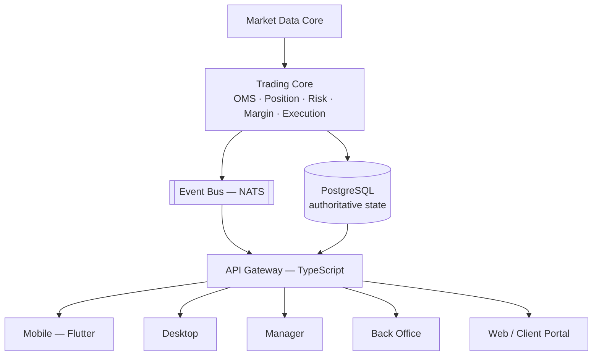
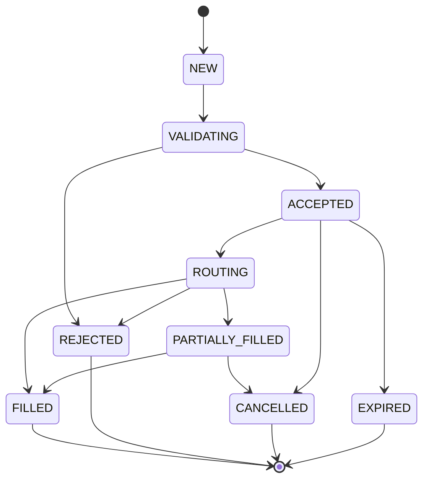

# VyXTrader — System Architecture (Phase 0)

Status: **Phase 0 complete.** §6 resolved — ADR-001 through ADR-003
accepted, see `decisions.md`. All 12 `/docs` files written (§8).

---

## 1. Current State (what exists today, before this spec)

VyXTrader today is a single Next.js 15 monolith:

- **Web app** (`app/`, `components/`) — Next.js App Router, TypeScript,
  Tailwind. Multi-tenant: `middleware.ts` resolves a `Broker` from the
  request's Host header (subdomain or custom domain) and attaches
  `x-broker-*` headers every downstream route reads. Two separate JWT
  session systems (`lib/auth.ts` for admins, `lib/account-auth.ts` for
  traders) — httpOnly cookies, no client-held tokens.
- **Database**: PostgreSQL via Neon, accessed through Prisma (client
  library, not a service). Current models: `Broker`, `AdminUser`,
  `Account`, `KycRecord`, `Transaction`, `Symbol`, `LivePrice`, `Candle`,
  `BrokerSymbol`, `Order`, `Position`, `IbRelationship`, `AuditLog`. Money
  fields are `Decimal`, never `Float` — this rule already holds and carries
  forward unchanged.
- **Trading logic**: lives directly in Next.js API routes
  (`app/api/trade/*`) calling Prisma. `lib/trading.ts` has server-side SL/TP
  validation and P&L math. There is no separate trading-core process —
  the API route *is* the order management logic today.
- **Market data**: a real MT5 EA (`mt5-ea/`) pushes live bid/ask from a
  broker's own MT5 terminal to `/api/internal/price-feed`, written into
  `LivePrice` (latest tick) and `Candle` (OHLC aggregated at write time,
  9 timeframes: M1/M5/M30/H1/H4/D1/W1/MN1/Y1). Symbols the EA doesn't cover
  fall back to a client-side random-walk simulator
  (`lib/market-simulator.ts`). This is explicitly a Phase-5-stopgap by
  design, already documented as such in the existing codebase.
- **Desktop**: an **Electron** wrapper (`desktop/`) — built earlier in this
  engagement, already working (frameless custom title bar, system tray,
  native notifications, auto-update via a generic feed, per-broker
  rebranding via `broker.config.json` + an icon swap). It loads the same
  web app's pages in a native window; it does not embed any trading logic
  of its own.
- **Mobile, Manager app, Back Office**: do not exist yet. The current
  Super Admin (`app/(super-admin)`) covers a thin slice of what "Manager"
  and "Back Office" describe below (broker creation, admin login) — Phase 3
  in the existing roadmap (KYC review, real deposit/withdraw, IB
  commission) was never started.
- **Root-domain launcher** (`app/launch`): an MT5-style "pick your server,
  log in" screen added this engagement, using a real cross-site
  `<form method="POST">` submit so a password never has to travel through
  a URL, landing on `/api/trade/login-redirect` on the picked broker's own
  subdomain (so the session cookie ends up scoped correctly).

None of this is "wrong" — it was built deliberately as a fast-moving MVP.
The question this document has to answer is how much of it survives as-is,
how much gets wrapped by a new authoritative Trading Core, and how much
gets replaced outright — see §6.

---

## 2. Target State (per this spec)

A single authoritative **Trading Core** (Rust) that Order Management,
Position, Risk, Margin, and Execution all live inside, with every other
surface (Desktop, Mobile, Manager, Back Office, Web) as a client of it —
never re-implementing trading decisions locally.



Redis sits beside this for cache/session/rate-limiting only — never as the
authoritative financial store. NATS carries internal events (order
updates, position changes, price ticks) from the Trading Core out to the
Gateway, which fans them out over WebSocket to connected clients.

---

## 3. Monorepo Structure

Adapting the spec's suggested layout to what already exists (moving files,
not rewriting them, wherever the current code already does the job):

```
/apps
  /web            ← current app/ + components/ (Next.js) — becomes the
                     Client Portal + Super Admin, minus trading logic
                     once that moves into the Trading Core
  /manager        ← new — broker/dealing/risk/ops tool (spec §17)
  /backoffice     ← new — CRM/KYC/finance/reporting (spec §18)
  /desktop        ← current desktop/ (Electron), stays live until Phase 4;
                     new Tauri app added alongside it — see ADR-001
  /mobile         ← new — Flutter (spec §16)

/engine           ← NEW — the Rust Trading Core
  /market-data
  /order-management
  /position
  /risk
  /margin
  /execution
  /ledger

/services         ← TypeScript, non-latency-critical
  /api-gateway    ← REST + WebSocket fan-out, auth, RBAC enforcement
  /notification-service

/libs
  /protocol       ← shared event/message schemas (Rust + TS codegen)
  /instrument     ← symbol specification registry
  /config
  /security

/prisma           ← current prisma/ — becomes the Postgres schema owner
                     for account/config/audit data; the Trading Core's
                     own tables (orders, positions, ledger) are proposed
                     to live in the same Postgres instance but written
                     only by the Rust engine (see §6 Decision 2)

/mt5-ea           ← unchanged — still the price-feed bridge into
                     Market Data Core, same role it has today

/docs             ← this folder
/tests
/infrastructure
  /docker
  /kubernetes     ← added only once scale actually requires it, per spec
```

---

## 4. Tech Stack Decisions

| Layer | Technology | Status |
|---|---|---|
| Trading Core (OMS/Risk/Position/Margin/Execution/Ledger) | Rust | New — does not exist today |
| Market Data Core | Rust | New — replaces/absorbs the current TS price-feed ingest logic |
| API Gateway | TypeScript/Node.js | New — the current Next.js API routes play this role today; gets extracted |
| Web (Client Portal, Super Admin) | Next.js + TypeScript | Already exists, keeps this role |
| Desktop | Tauri (new, for Phase 4 Trading Core workstation) | Accepted — ADR-001, see `decisions.md` |
| Mobile | Flutter + Dart | New — does not exist today |
| Manager | Next.js + TypeScript | New — does not exist today |
| Back Office | Next.js + TypeScript | New — Phase 3 of the old roadmap never started this |
| Database | PostgreSQL | Already in place (Neon) |
| Cache/session | Redis | New — sessions are currently httpOnly JWT cookies with no server-side session store; Redis would add revocable sessions and rate-limiting |
| Internal messaging | NATS | New — no event bus exists today; price updates and order state changes currently just re-render via polling/direct Prisma reads |

---

## 5. Order State Machine (target)



This is a superset of the current schema's `OrderStatus` enum
(`PENDING → ACCEPTED → FILLED/REJECTED/CANCELLED`) — `NEW`/`VALIDATING`/
`ROUTING`/`PARTIALLY_FILLED` are new states the Rust core introduces that
the current Next.js-based OMS doesn't distinguish today (it currently
treats "accepted" and "filled" as effectively the same instant for MARKET
orders, per the existing codebase's own documented simplification: "MARKET
orders trust the client-supplied execution price until Phase 5's real
matching engine exists").

---

## 6. Decisions Requiring Approval

Per the project's own rule: *"If you identify a better technology or
architecture than something specified above, DO NOT silently change it.
Explain the alternative, its advantages/disadvantages, and wait for
approval before changing a core architectural decision."* All three below
were flagged, then resolved per explicit direction to follow the spec as
written. Full status/rationale lives in `decisions.md` (ADR-001 through
ADR-003); this section keeps the original context/options for reference.

### Decision 1 — Desktop shell: keep Electron, or migrate to Tauri?

**Resolved: Tauri (ADR-001).** The spec's default is Tauri ("Do NOT use
Electron unless there is a specific documented requirement that Tauri
cannot satisfy"), and that's the call for the Phase 4 Trading Core
desktop workstation. The existing Electron app (frameless custom title
bar, system tray with minimize-to-tray, native OS notifications,
`electron-updater` wired to a real update feed, per-broker rebranding via
`broker.config.json` + `rebrand.js`) is not thrown away — it stays in
place and keeps serving the current Next.js-only web app until Phase 4's
Tauri app is ready to replace it.

| | Electron (current) | Tauri (Phase 4 target) |
|---|---|---|
| Status | Built, tested, working today | New build |
| Binary size | ~80MB installer | Typically 3-10MB (uses the OS's native webview) |
| Memory footprint | Higher (bundles Chromium) | Lower (no bundled browser engine) |
| Backend language | Node.js (JS/TS) | Rust — shares code/types directly with the Trading Core |
| Ecosystem/maturity | Very mature, huge community | Newer, smaller but growing fast, backed seriously |

Migration/cutover notes for replacing the Electron shell live in
`deployment.md` once written.

### Decision 2 — Where does the Rust Trading Core's data live, and how does today's Prisma-owned data migrate?

**Resolved: option (a) below (ADR-002).**

Two shapes are possible:

**(a) Same Postgres instance, new tables, Rust-owned.** The Trading Core
gets its own tables (`orders`, `positions`, `ledger_entries`, etc.) in the
same Neon Postgres database, written only by the Rust engine. Next.js
stops writing `Order`/`Position`/`Transaction` directly — those become
read-only projections the API Gateway queries, or the Gateway calls into
the Trading Core over its API instead of touching Postgres for trading
data at all. Prisma keeps owning `Broker`/`AdminUser`/`Account`/`KycRecord`/
`Symbol`/`BrokerSymbol`/`IbRelationship`/`AuditLog` — the non-trading,
config/CRM-shaped data — since that's arguably not latency-critical and
fits Prisma/TypeScript fine per the spec's own guidance (§1: TypeScript
for "non-latency-critical business logic").

**(b) Separate database entirely**, with the Trading Core's Postgres
instance independent of the current Neon database, synchronized via
events (NATS) for anything the web app needs to display.

(a) is one Postgres instance, clear table ownership boundary — no
cross-database consistency problem to solve, and nothing about today's
scale needs database-level isolation. The spec's own §16 ("PostgreSQL is
the authoritative source... Never make Redis the authoritative financial
database") reads as one authoritative Postgres, not several, which (a)
already matches without deviation.

Existing demo data (the seeded `AcmeFX`/`Nova Markets` brokers, their demo
accounts and any positions opened during this engagement's testing) would
need a one-time migration script once the Rust `orders`/`positions`/
`ledger_entries` tables exist, translating current `Order`/`Position`/
`Transaction` rows into the new shape. Given this is pre-production demo
data, the simplest honest option is likely "re-seed rather than migrate" —
flagging rather than assuming, since that's a data-loss-adjacent call.

### Decision 3 — How much of the current Next.js trading logic is kept running during the Rust core's build-out?

**Resolved: keep the current path live (ADR-003).** The spec's Phase 1-2
order (Rust workspace → Trading Core with extensive tests) implies a
period where the Rust core exists but isn't finished. During that window,
the *current* Next.js/Prisma order placement (`app/api/trade/orders`,
`lib/trading.ts`) keeps running as the live system unmodified, while the
Rust core is built in parallel behind its own milestone gates (matching
the spec's own Phase 1-2 ordering). Cut over broker-by-broker once the
Rust core passes its own test/benchmark gates (spec §21, §29's
"Definition of Done"). This matches the "never destroy existing working
functionality" rule and the spec's own instruction not to rewrite the
whole project without explicit instruction — no deviation from the spec
here, just the option the spec itself already pointed at.

---

## 7. How This Maps to the Spec's Own Phases

| Spec Phase | Maps to |
|---|---|
| Phase 0 — Architecture | This document + the 11 siblings in `/docs` (in progress) |
| Phase 1 — Core Foundation | New: Rust workspace, Postgres/Redis/NATS wiring, API Gateway extraction, auth rework |
| Phase 2 — Trading Core | New: the actual OMS/Risk/Margin/Position/Ledger Rust modules |
| Phase 3 — Market Data | Extends the existing MT5 EA bridge + candle aggregation, moved into Rust |
| Phase 4 — Desktop | New Tauri app per ADR-001; current Electron app stays live until it's ready to cut over |
| Phase 5 — Mobile | New, not started |
| Phase 6 — Manager | Started: symbol/spread config, positions/exposure dashboard, and manual position open/close (`app/manage/`) live — see `authentication.md` §3 and this doc's log below. Rest (groups, users, deposit/withdraw ops) not started. |
| Phase 7 — Back Office | New, not started |
| Phase 8 — Advanced | New, not started |

---

## 8. Immediate Next Steps

1. ~~Resolve Decisions 1-3 above.~~ Done — see `decisions.md` (ADR-001
   through ADR-003).
2. ~~Write the remaining `/docs` files~~ Done: `trading-engine.md`,
   `risk-engine.md`, `execution.md`, `market-data.md`, `database.md`,
   `api.md`, `authentication.md`, `security.md`, `deployment.md`,
   `testing.md`, `decisions.md` all exist alongside this file.
3. Phase 1 (Rust workspace scaffold) — done: `/engine` exists with all
   8 module crates (`protocol`, `market-data`, `order-management`,
   `position`, `risk`, `margin`, `execution`, `ledger`). Pure-function
   logic with no I/O dependency is implemented and unit-tested (16 tests,
   0 failures): state-machine legality, the margin formula, margin-call/
   stop-out evaluation, candle bucketing, internal-strategy fill pricing.
   See `/engine/README.md`.
4. Phase 2 (Trading Core) — first slice done: Postgres schema for the
   Rust-owned tables (`engine/migrations/`, per ADR-002 — applied to the
   live database), a `sqlx`-based persistence layer in
   `order-management::db`, a real `place_market_order` orchestration
   function wiring OMS -> Risk -> Execution -> Position in one
   transaction (matching the sequence diagram in `trading-engine.md` §2),
   and NATS event publishing (`order-management::events`) after each
   commit.
5. Phase 2 continued — API Gateway skeleton: `engine/server` is a new
   Rust binary (`trading-core-server`, Axum) exposing
   `POST /v1/orders/market` over HTTP, wired to `place_market_order`; this
   is what makes the Trading Core an actual running service instead of a
   library nothing calls. `services/api-gateway` is a new standalone
   TypeScript service (own `package.json`, doesn't touch the root Next.js
   app) that verifies the existing trader JWT session
   (`vyx_trade_session`, same secret as `lib/account-auth.ts`) and
   forwards authenticated order requests to `trading-core-server`. Both
   verified locally: the Rust server builds clean, the Gateway
   type-checks, builds, and its health/auth-rejection behavior was
   smoke-tested end to end.

6. Phase 2 continued — closed the "trusts the client" gap: the Gateway
   now fetches Account (balance/credit/leverage/status), Symbol
   (contractSize), and LivePrice itself via a read-only `pg` client
   (`services/api-gateway/src/db.ts` — plain SQL, not Prisma Client,
   since sharing a generated Prisma client across two independently
   -installed npm packages needs monorepo/workspace tooling this project
   doesn't have; that would mean touching the root `package.json`, out of
   scope for closing this specific gap) and computes used margin from the
   account's open Rust-owned positions. A client can now only specify
   *which* order to place, never fake its own balance/margin/price.
   Money math uses `decimal.js` throughout, matching the project's
   Decimal-only rule.

7. Phase 2 continued — equity now includes floating P&L: `getOpenPositionsSummary`
   (`services/api-gateway/src/db.ts`) computes both used margin and
   unrealized P&L for the account's open Rust-owned positions in one
   query (LEFT JOIN on `LivePrice` so a position with no current tick
   still counts toward margin, just not toward P&L — silently dropping it
   would understate risk). Formula matches `lib/trading.ts`'s
   `computeRealizedPnl` exactly. `equity = balance + credit + floatingPnl`.

8. Phase 2 continued — margin monitor implemented:
   `order_management::monitor` polls every account with an open position
   on an interval (`MARGIN_MONITOR_INTERVAL_SECS`, default 5s — not
   literally tick-driven yet, since no running Rust market-data ingest
   service exists to trigger it off real ticks; polling is the honest
   interim substitute, see `market-data.md`'s implementation status),
   computes equity/used margin the same way the order-placement path
   does, and calls `margin::evaluate`. On margin call it publishes a
   `margin.call` NATS event. On stop-out it force-closes the account's
   worst (most negative floating P&L) closeable position, records the
   realized P&L as a `ledger_entries` row, and repeats until the account
   is back above the stop-out threshold or runs out of closeable
   positions — bounded by the account's own open-position count, so it
   can't loop unboundedly. Spawned as a background task alongside the
   Axum server in `engine/server`.

   **Resolved a real ownership question along the way:** `Account.balance`
   is Prisma-owned (ADR-002) and this crate never writes it, but
   force-closing a position realizes P&L that has to count toward the
   account's true balance somehow. Resolution: `ledger_entries` (already
   Rust-owned) is the delta trail — "effective balance" = `Account.balance
   + SUM(ledger_entries.amount)`. Both the monitor and
   `services/api-gateway` (order placement's equity calc) now compute it
   this way identically, so nobody has to cross the ownership boundary to
   write a number the other side already owns.

9. Phase 1 item closed — Redis-backed sessions: trader sessions
   (`lib/account-auth.ts`) are now Redis-backed opaque tokens instead of
   self-contained JWTs, so logout (`app/api/trade/logout`) actually
   revokes the session immediately rather than only clearing a cookie
   whose JWT would otherwise stay valid until its own expiry. Login-attempt
   rate limiting (`lib/rate-limit.ts`) added to both login routes. This
   *does* touch the live Next.js login/logout routes (`trade/login`,
   `trade/login-redirect`, `trade/logout`) — done carefully, verified with
   a full type-check of the whole app (0 errors) plus functional tests
   against a local Redis-compatible server (Memurai) before considering it
   done. `services/api-gateway` reads the same Redis session convention.
   Admin sessions (`lib/auth.ts`) are unchanged — out of scope here.

   Nothing else open from the original Phase 1/2 gap list. The existing
   Next.js trading path is untouched throughout, per ADR-003.

10. **Phase 3 (Market Data) — first slice done:** the Rust ingest path
    (`engine/market-data::db`/`::ingest`) ports `lib/price-feed.ts`'s
    `LivePrice`/`Candle` upsert SQL unchanged (same `ON CONFLICT ...
    GREATEST/LEAST` bucket-widening), reusing the already-tested pure
    bucketing logic from Phase 1. `engine/server` exposes it as
    `POST /internal/price-feed` (header-secret auth, same
    `PRICE_FEED_SECRET` value as the Next.js side). `lib/price-feed.ts`
    now forwards to that route (`TRADING_CORE_URL`) instead of writing
    Prisma directly — Market Data Core is the sole writer of
    `LivePrice`/`Candle` in practice now, not just by documented intent
    (`market-data.md` §3). Each ingested tick also publishes to NATS on
    `price.tick.{symbol}`. The MT5 EA itself is untouched — Next.js stays
    a thin proxy in front of the Rust route rather than the EA being
    repointed directly, so there's no live-broker disruption; a direct
    EA→Rust cutover is a deliberately separate later step. See
    `market-data.md` §5 for the full implementation-status writeup,
    including the WebSocket fan-out (`services/api-gateway/src/ws.ts`)
    that replaced part of `WebTrader.tsx`'s client-side price polling
    with a push.

11. **Margin monitor made tick-driven**, same-day follow-up to #10:
    `order_management::monitor` now reacts to the `price.tick.*` stream
    #10 added, not just its polling timer (kept as a quiet-period safety
    net). Adding a second concurrent trigger source exposed and fixed a
    real double-close race in `close_position_with_ledger_entry` (no
    `WHERE status = 'OPEN'` guard on the force-close `UPDATE`) — now
    idempotent. Verified live end to end, including replaying the same
    stop-out-triggering tick to confirm no duplicate close/ledger entry.
    See `market-data.md` §5.

12. **Execution now reads its own live price**, closing the last item
    `execution.md` §4 had flagged from Phase 2's original skeleton:
    `place_market_order` fetches the current tick itself from Market
    Data Core instead of trusting a `current_tick` the API Gateway
    supplied in the request. `PlaceMarketOrderRequest` had the field
    removed outright (not just unused), and the Gateway's matching
    `getLivePrice` read was deleted as dead code. Verified live: a fill
    at the correct seeded price with zero price data in the request
    payload, a clean rejection for a symbol with no live price, and
    confirmation the pre-existing free-margin rejection still fires
    correctly with the reordered checks. See `execution.md` §5.

13. **Per-position SL/TP is now actually enforced** — a gap found while
    auditing for exactly this class of issue, not something either this
    doc or `risk-engine.md` had previously flagged as deferred. Until
    now, nothing server-side ever closed a position when price reached
    the trader's own stop-loss/take-profit; only unrelated margin-ratio
    stop-out could force-close anything. `order_management::monitor`
    checks every open position's SL/TP against the current tick before
    its margin-level check, closing any that crossed and publishing
    `position.stop_loss_hit`/`position.take_profit_hit`. Verified live: a
    BUY's SL and a SELL's TP both triggered correctly on the same tick
    with correct realized P&L, and the tick-driven trigger confirmed to
    actually fire within about a second (not just the polling-timer
    fallback masking it, which a too-tight first timing test briefly
    misidentified as a bug before a longer wait disproved it). See
    `risk-engine.md` §5.

14. **LIMIT/STOP orders**, closing `execution.md` §2.1 step 3 — the last
    unimplemented step in Execution's own documented design.
    `place_pending_order` accepts a LIMIT/STOP order with no margin
    reserved while it waits (only placement-time price-side validation);
    a new `order-management::pending_orders` module, driven by the same
    `price.tick.*` subscription the margin monitor uses (now fanned out
    to both concurrently from one subscription, not two), checks the
    real margin requirement only when the order actually triggers —
    matching `place_market_order`'s check exactly — and fills or rejects
    accordingly. Reuses the stop-out/SL-TP idempotent-claim pattern
    (`try_claim_order_for_routing`) for the same double-trigger
    protection. `POST /v1/orders/pending` added to both `engine/server`
    and the Gateway. Verified live: placement-time price-side rejection,
    trigger-time fill at the correct price opening a real position, and
    trigger-time margin rejection for a deliberately oversized order that
    placement let through (proving the margin check truly defers to
    trigger time). See `execution.md` §5.

15. **Phase 6 (Manager) — first screen: symbol/spread config.** Closes a
    real, standing gap: `BrokerSymbol`'s pricing/risk fields
    (`spreadMarkup`, lot limits, swap, `commissionPerLot`, `maxExposure`)
    had zero admin UI — direct DB edit only, even though the Rust engine
    had been reading and enforcing all of them for several slices already.
    New `app/manage/` route group, modeled on MT5's own Manager terminal
    Symbols tab (one grid, one row per symbol, per-row save) per the
    user's explicit request. Lives on the broker's own subdomain, not a
    new `manager.<ROOT_DOMAIN>` subdomain — a deliberate, confirmed
    deviation from this doc's own §3 target framing, since the
    `/apps/*` monorepo split hasn't happened and would've been unrelated
    setup work for one screen. New `MANAGER` role under the existing
    admin-session system (not a new one), plus a `getAdminSession()`
    hardening (broker-scoped sessions now cross-check `x-broker-id`) that
    benefits every broker-scoped admin role, not just this one. See
    `authentication.md` §3 for the full writeup and live verification.

16. **Phase 6 (Manager) — second screen: positions/exposure dashboard.**
    `app/manage/positions/page.tsx`. Two views: net exposure per symbol
    (buy volume − sell volume — what a dealing desk actually watches, not
    raw position count) and a full open-positions list with live floating
    P&L, both broker-scoped off the same `getAdminSession()` guard as the
    symbols screen. Reads Prisma's `Position` table, not the Rust-owned
    `positions` table — per ADR-003 no broker has cut over to the Rust
    engine yet, so Prisma's table is where real trading data actually
    lives today (same table the trader-facing view already reads);
    revisit once a broker cuts over. Found and worked around a real
    schema gap along the way — see `database.md` §6 (`DateTime` columns
    aren't timezone-aware, flagged there rather than fixed schema-wide).
    Verified live: exposure aggregation and floating P&L both hand-checked
    against seeded positions with known open prices and a known current
    price, correct in both directions (BUY/SELL); pre-existing real demo
    positions from earlier manual testing rendered correctly alongside
    the seeded ones, confirming this isn't only correct against synthetic
    data.

17. **Phase 6 (Manager) — third feature: manual position open/close.**
    `app/api/manage/positions/route.ts` (open) and
    `app/api/manage/positions/[id]/close/route.ts` (close), UI in
    `PositionsManager.tsx`. The user's own first word for the close
    action was "delete" — clarified against `CLAUDE.md`'s own
    non-negotiable rule ("never delete executed trades... corrections
    are compensating entries") before writing any code: this is a state
    transition (OPEN → CLOSED, same state machine as every other close),
    never a row deletion. First real usage of two things the schema
    already anticipated but nothing wrote: `Position.closedByAdminId`
    and the `"MANUAL_POSITION_CLOSE"` `AuditLog` action (both existed as
    schema fields/doc-comment conventions with zero application code
    using them until now). Mirrors the trader-initiated close route's
    exact money-math ($transaction reads `Account.balance`, computes
    `balanceAfter` explicitly rather than `increment`, writes a
    `TRADE_PNL` `Transaction` row) — same correctness, admin-scoped
    instead of trader-owned, plus the new `closedByAdminId`/`AuditLog`
    writes. Confirmed with the user: price for both open and close comes
    from `LivePrice` automatically (same 15s freshness rule as
    `database.md` §6, factored into a shared `lib/live-price.ts` used by
    this feature and the positions dashboard both) rather than an
    admin-typed value, since a wrong manually-entered price would
    mis-book a real account's balance. No margin check on manual open —
    matches the existing trader-facing MARKET order route's own current
    baseline (confirmed via code search: no margin check exists there
    either), not a new gap introduced by this feature.

    Verified live end to end against a real Postgres: opened a BUY
    position, confirmed the correct ask-price fill and a
    `MANUAL_POSITION_OPEN` audit row; partial-closed 0.4 of 1.0 lots at a
    known bid, confirmed the exact expected realized P&L, an exact
    matching `Account.balance` delta, the position staying `OPEN` at the
    reduced volume, and a `TRADE_PNL` `Transaction` row with correct
    `balanceBefore`/`balanceAfter`; the staleness rule fired for real
    (not just as a manufactured test) when enough wall-clock time passed
    between steps, rejecting the follow-up close attempt with "no live
    price" until the price was refreshed — then closed the remaining 0.6
    lots fully, confirmed `status: CLOSED`, `closedByAdminId` set to the
    acting admin, and the second `MANUAL_POSITION_CLOSE` audit row.
    Confirmed broker-scoping: opening a position against a different
    broker's account with this session was cleanly rejected
    ("account not found"), not permitted or leaked across tenants.
