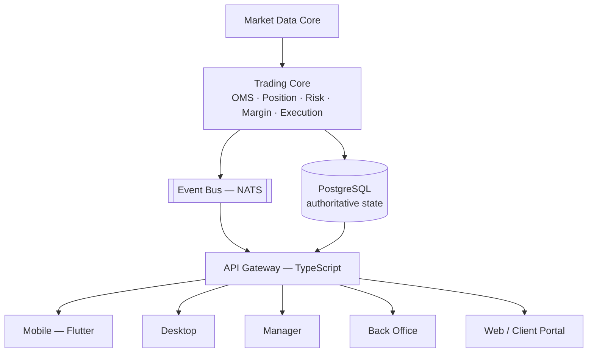
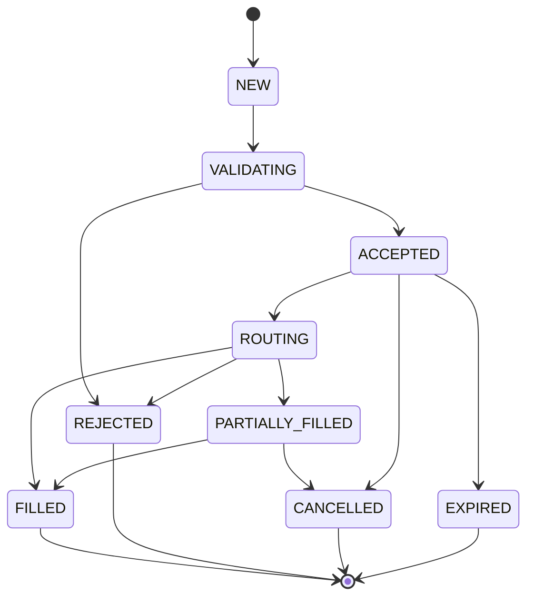

# VyXTrader — System Architecture (Phase 0)

Status: **Phase 0 complete.** §6 resolved — ADR-001 through ADR-003
accepted, see `decisions.md`. All 12 `/docs` files written (§8).

---

## 1. Current State (what exists today, before this spec)

VyXTrader today is a single Next.js 15 monolith:

- **Web app** (`app/`, `components/`) — Next.js App Router, TypeScript,
  Tailwind. Multi-tenant: `middleware.ts` resolves a `Broker` from the
  request's Host header (subdomain or custom domain) and attaches
  `x-broker-*` headers every downstream route reads. Two separate JWT
  session systems (`lib/auth.ts` for admins, `lib/account-auth.ts` for
  traders) — httpOnly cookies, no client-held tokens.
- **Database**: PostgreSQL via Neon, accessed through Prisma (client
  library, not a service). Current models: `Broker`, `AdminUser`,
  `Account`, `KycRecord`, `Transaction`, `Symbol`, `LivePrice`, `Candle`,
  `BrokerSymbol`, `Order`, `Position`, `IbRelationship`, `AuditLog`. Money
  fields are `Decimal`, never `Float` — this rule already holds and carries
  forward unchanged.
- **Trading logic**: lives directly in Next.js API routes
  (`app/api/trade/*`) calling Prisma. `lib/trading.ts` has server-side SL/TP
  validation and P&L math. There is no separate trading-core process —
  the API route *is* the order management logic today.
- **Market data**: a real MT5 EA (`mt5-ea/`) pushes live bid/ask from a
  broker's own MT5 terminal to `/api/internal/price-feed`, written into
  `LivePrice` (latest tick) and `Candle` (OHLC aggregated at write time,
  9 timeframes: M1/M5/M30/H1/H4/D1/W1/MN1/Y1). Symbols the EA doesn't cover
  fall back to a client-side random-walk simulator
  (`lib/market-simulator.ts`). This is explicitly a Phase-5-stopgap by
  design, already documented as such in the existing codebase.
- **Desktop**: an **Electron** wrapper (`desktop/`) — built earlier in this
  engagement, already working (frameless custom title bar, system tray,
  native notifications, auto-update via a generic feed, per-broker
  rebranding via `broker.config.json` + an icon swap). It loads the same
  web app's pages in a native window; it does not embed any trading logic
  of its own.
- **Mobile, Manager app, Back Office**: do not exist yet. The current
  Super Admin (`app/(super-admin)`) covers a thin slice of what "Manager"
  and "Back Office" describe below (broker creation, admin login) — Phase 3
  in the existing roadmap (KYC review, real deposit/withdraw, IB
  commission) was never started.
- **Root-domain launcher** (`app/launch`): an MT5-style "pick your server,
  log in" screen added this engagement, using a real cross-site
  `<form method="POST">` submit so a password never has to travel through
  a URL, landing on `/api/trade/login-redirect` on the picked broker's own
  subdomain (so the session cookie ends up scoped correctly).

None of this is "wrong" — it was built deliberately as a fast-moving MVP.
The question this document has to answer is how much of it survives as-is,
how much gets wrapped by a new authoritative Trading Core, and how much
gets replaced outright — see §6.

---

## 2. Target State (per this spec)

A single authoritative **Trading Core** (Rust) that Order Management,
Position, Risk, Margin, and Execution all live inside, with every other
surface (Desktop, Mobile, Manager, Back Office, Web) as a client of it —
never re-implementing trading decisions locally.



Redis sits beside this for cache/session/rate-limiting only — never as the
authoritative financial store. NATS carries internal events (order
updates, position changes, price ticks) from the Trading Core out to the
Gateway, which fans them out over WebSocket to connected clients.

---

## 3. Monorepo Structure

Adapting the spec's suggested layout to what already exists (moving files,
not rewriting them, wherever the current code already does the job):

```
/apps
  /web            ← current app/ + components/ (Next.js) — becomes the
                     Client Portal + Super Admin, minus trading logic
                     once that moves into the Trading Core
  /manager        ← new — broker/dealing/risk/ops tool (spec §17)
  /backoffice     ← new — CRM/KYC/finance/reporting (spec §18)
  /desktop        ← current desktop/ (Electron), stays live until Phase 4;
                     new Tauri app added alongside it — see ADR-001
  /mobile         ← new — Flutter (spec §16)

/engine           ← NEW — the Rust Trading Core
  /market-data
  /order-management
  /position
  /risk
  /margin
  /execution
  /ledger

/services         ← TypeScript, non-latency-critical
  /api-gateway    ← REST + WebSocket fan-out, auth, RBAC enforcement
  /notification-service

/libs
  /protocol       ← shared event/message schemas (Rust + TS codegen)
  /instrument     ← symbol specification registry
  /config
  /security

/prisma           ← current prisma/ — becomes the Postgres schema owner
                     for account/config/audit data; the Trading Core's
                     own tables (orders, positions, ledger) are proposed
                     to live in the same Postgres instance but written
                     only by the Rust engine (see §6 Decision 2)

/mt5-ea           ← unchanged — still the price-feed bridge into
                     Market Data Core, same role it has today

/docs             ← this folder
/tests
/infrastructure
  /docker
  /kubernetes     ← added only once scale actually requires it, per spec
```

---

## 4. Tech Stack Decisions

| Layer | Technology | Status |
|---|---|---|
| Trading Core (OMS/Risk/Position/Margin/Execution/Ledger) | Rust | New — does not exist today |
| Market Data Core | Rust | New — replaces/absorbs the current TS price-feed ingest logic |
| API Gateway | TypeScript/Node.js | New — the current Next.js API routes play this role today; gets extracted |
| Web (Client Portal, Super Admin) | Next.js + TypeScript | Already exists, keeps this role |
| Desktop | Tauri (new, for Phase 4 Trading Core workstation) | Accepted — ADR-001, see `decisions.md` |
| Mobile | Flutter + Dart | New — does not exist today |
| Manager | Next.js + TypeScript | New — does not exist today |
| Back Office | Next.js + TypeScript | New — Phase 3 of the old roadmap never started this |
| Database | PostgreSQL | Already in place (Neon) |
| Cache/session | Redis | New — sessions are currently httpOnly JWT cookies with no server-side session store; Redis would add revocable sessions and rate-limiting |
| Internal messaging | NATS | New — no event bus exists today; price updates and order state changes currently just re-render via polling/direct Prisma reads |

---

## 5. Order State Machine (target)



This is a superset of the current schema's `OrderStatus` enum
(`PENDING → ACCEPTED → FILLED/REJECTED/CANCELLED`) — `NEW`/`VALIDATING`/
`ROUTING`/`PARTIALLY_FILLED` are new states the Rust core introduces that
the current Next.js-based OMS doesn't distinguish today (it currently
treats "accepted" and "filled" as effectively the same instant for MARKET
orders, per the existing codebase's own documented simplification: "MARKET
orders trust the client-supplied execution price until Phase 5's real
matching engine exists").

---

## 6. Decisions Requiring Approval

Per the project's own rule: *"If you identify a better technology or
architecture than something specified above, DO NOT silently change it.
Explain the alternative, its advantages/disadvantages, and wait for
approval before changing a core architectural decision."* All three below
were flagged, then resolved per explicit direction to follow the spec as
written. Full status/rationale lives in `decisions.md` (ADR-001 through
ADR-003); this section keeps the original context/options for reference.

### Decision 1 — Desktop shell: keep Electron, or migrate to Tauri?

**Resolved: Tauri (ADR-001).** The spec's default is Tauri ("Do NOT use
Electron unless there is a specific documented requirement that Tauri
cannot satisfy"), and that's the call for the Phase 4 Trading Core
desktop workstation. The existing Electron app (frameless custom title
bar, system tray with minimize-to-tray, native OS notifications,
`electron-updater` wired to a real update feed, per-broker rebranding via
`broker.config.json` + `rebrand.js`) is not thrown away — it stays in
place and keeps serving the current Next.js-only web app until Phase 4's
Tauri app is ready to replace it.

| | Electron (current) | Tauri (Phase 4 target) |
|---|---|---|
| Status | Built, tested, working today | New build |
| Binary size | ~80MB installer | Typically 3-10MB (uses the OS's native webview) |
| Memory footprint | Higher (bundles Chromium) | Lower (no bundled browser engine) |
| Backend language | Node.js (JS/TS) | Rust — shares code/types directly with the Trading Core |
| Ecosystem/maturity | Very mature, huge community | Newer, smaller but growing fast, backed seriously |

Migration/cutover notes for replacing the Electron shell live in
`deployment.md` once written.

### Decision 2 — Where does the Rust Trading Core's data live, and how does today's Prisma-owned data migrate?

**Resolved: option (a) below (ADR-002).**

Two shapes are possible:

**(a) Same Postgres instance, new tables, Rust-owned.** The Trading Core
gets its own tables (`orders`, `positions`, `ledger_entries`, etc.) in the
same Neon Postgres database, written only by the Rust engine. Next.js
stops writing `Order`/`Position`/`Transaction` directly — those become
read-only projections the API Gateway queries, or the Gateway calls into
the Trading Core over its API instead of touching Postgres for trading
data at all. Prisma keeps owning `Broker`/`AdminUser`/`Account`/`KycRecord`/
`Symbol`/`BrokerSymbol`/`IbRelationship`/`AuditLog` — the non-trading,
config/CRM-shaped data — since that's arguably not latency-critical and
fits Prisma/TypeScript fine per the spec's own guidance (§1: TypeScript
for "non-latency-critical business logic").

**(b) Separate database entirely**, with the Trading Core's Postgres
instance independent of the current Neon database, synchronized via
events (NATS) for anything the web app needs to display.

(a) is one Postgres instance, clear table ownership boundary — no
cross-database consistency problem to solve, and nothing about today's
scale needs database-level isolation. The spec's own §16 ("PostgreSQL is
the authoritative source... Never make Redis the authoritative financial
database") reads as one authoritative Postgres, not several, which (a)
already matches without deviation.

Existing demo data (the seeded `AcmeFX`/`Nova Markets` brokers, their demo
accounts and any positions opened during this engagement's testing) would
need a one-time migration script once the Rust `orders`/`positions`/
`ledger_entries` tables exist, translating current `Order`/`Position`/
`Transaction` rows into the new shape. Given this is pre-production demo
data, the simplest honest option is likely "re-seed rather than migrate" —
flagging rather than assuming, since that's a data-loss-adjacent call.

### Decision 3 — How much of the current Next.js trading logic is kept running during the Rust core's build-out?

**Resolved: keep the current path live (ADR-003).** The spec's Phase 1-2
order (Rust workspace → Trading Core with extensive tests) implies a
period where the Rust core exists but isn't finished. During that window,
the *current* Next.js/Prisma order placement (`app/api/trade/orders`,
`lib/trading.ts`) keeps running as the live system unmodified, while the
Rust core is built in parallel behind its own milestone gates (matching
the spec's own Phase 1-2 ordering). Cut over broker-by-broker once the
Rust core passes its own test/benchmark gates (spec §21, §29's
"Definition of Done"). This matches the "never destroy existing working
functionality" rule and the spec's own instruction not to rewrite the
whole project without explicit instruction — no deviation from the spec
here, just the option the spec itself already pointed at.

---

## 7. How This Maps to the Spec's Own Phases

| Spec Phase | Maps to |
|---|---|
| Phase 0 — Architecture | This document + the 11 siblings in `/docs` (in progress) |
| Phase 1 — Core Foundation | New: Rust workspace, Postgres/Redis/NATS wiring, API Gateway extraction, auth rework |
| Phase 2 — Trading Core | New: the actual OMS/Risk/Margin/Position/Ledger Rust modules |
| Phase 3 — Market Data | Extends the existing MT5 EA bridge + candle aggregation, moved into Rust |
| Phase 4 — Desktop | New Tauri app per ADR-001; current Electron app stays live until it's ready to cut over |
| Phase 5 — Mobile | New, not started |
| Phase 6 — Manager | New, not started (old roadmap's Phase 3 backoffice work never began either) |
| Phase 7 — Back Office | New, not started |
| Phase 8 — Advanced | New, not started |

---

## 8. Immediate Next Steps

1. ~~Resolve Decisions 1-3 above.~~ Done — see `decisions.md` (ADR-001
   through ADR-003).
2. ~~Write the remaining `/docs` files~~ Done: `trading-engine.md`,
   `risk-engine.md`, `execution.md`, `market-data.md`, `database.md`,
   `api.md`, `authentication.md`, `security.md`, `deployment.md`,
   `testing.md`, `decisions.md` all exist alongside this file.
3. Phase 1 (Rust workspace scaffold) — done: `/engine` exists with all
   8 module crates (`protocol`, `market-data`, `order-management`,
   `position`, `risk`, `margin`, `execution`, `ledger`). Pure-function
   logic with no I/O dependency is implemented and unit-tested (16 tests,
   0 failures): state-machine legality, the margin formula, margin-call/
   stop-out evaluation, candle bucketing, internal-strategy fill pricing.
   See `/engine/README.md`.
4. Phase 2 (Trading Core) — first slice done: Postgres schema for the
   Rust-owned tables (`engine/migrations/`, per ADR-002 — not yet applied
   to the live database, needs to be run manually the same way prior
   Prisma migrations were), a `sqlx`-based persistence layer in
   `order-management::db`, a real `place_market_order` orchestration
   function wiring OMS -> Risk -> Execution -> Position in one
   transaction (matching the sequence diagram in `trading-engine.md` §2),
   and NATS event publishing (`order-management::events`) after each
   commit. Still open: the API Gateway that would actually call
   `place_market_order` (today nothing invokes it — it's a library
   function, not a running service yet), Redis/session wiring, and the
   margin-monitor loop actually running continuously against live ticks
   (`margin::evaluate` exists and is tested, but nothing calls it on a
   schedule yet). The existing Next.js trading path is untouched
   throughout, per ADR-003.
