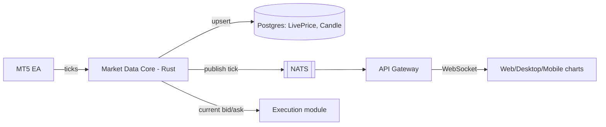

# Market Data Core

## 1. Today

A real MT5 EA (`mt5-ea/VyXTraderPriceFeed.mq5`) runs inside a broker's own
MT5 terminal and pushes live bid/ask ticks to
`app/api/internal/price-feed/[payload]` — a base64url-encoded path segment
(not a query string; an earlier debugging round found a network
intermediary stripping query strings entirely on the path the EA's
requests take, so the payload moved into the path itself as a workaround).
`lib/price-feed.ts` (`ingestTicks`) does the real work:

1. Auth via a shared secret compared against `PRICE_FEED_SECRET`.
2. Upserts `LivePrice` (latest bid/ask per symbol — one row per symbol,
   always current).
3. Upserts `Candle` for all 9 timeframes (`M1/M5/M30/H1/H4/D1/W1/MN1/Y1`)
   in the same transaction, using calendar-aware bucket boundaries for
   `W1`/`MN1`/`Y1` (weeks don't align to the Unix epoch at Monday, months
   and years aren't fixed-length) and fixed-millisecond floor-division for
   everything M1 through D1. High/low are widened via
   `GREATEST`/`LEAST` in the `ON CONFLICT` clause so a bucket's range
   stays correct across every tick that lands in it.

Symbols the EA doesn't cover (or brokers without an EA connected at all)
fall back to a client-side random-walk simulator
(`lib/market-simulator.ts`) — mirrors the same bucketing logic
independently on the client so the two data sources render identically
when a chart switches between real and simulated symbols. This dual-path
is an explicit, already-documented Phase-5 stopgap in the existing
codebase, not new information.

`app/api/trade/candles` serves chart history as a plain indexed
`Candle` select — no runtime aggregation over raw ticks, because the
aggregation already happened at ingest time.

## 2. Target: Rust Market Data Core

Absorbs `ingestTicks`'s logic essentially unchanged — the bucketing math
above is correct and stays; what moves is the process it runs in and who
else can consume it besides Postgres reads.

Two consumers that don't exist today: the Execution module (needs current
bid/ask synchronously for fills, see `execution.md`) and the NATS event
bus (so chart updates push over WebSocket instead of the current
client-side polling `WebTrader.tsx` does against `/api/trade/candles` and
`LivePrice`).

### 2.1 What changes vs. what doesn't

| | Today | Target |
|---|---|---|
| Tick ingest auth | Shared secret in URL path | Same shared-secret model carries forward; mTLS or a per-broker key is a Phase 3+ hardening item, not required for parity |
| Candle bucketing | `lib/price-feed.ts`, TypeScript | Same algorithm, ported to Rust — not redesigned |
| Fan-out to clients | Client polling | NATS publish → Gateway → WebSocket push |
| Fill-price source | N/A (Execution doesn't check price today) | Synchronous read by the Execution module |
| Simulator fallback | `lib/market-simulator.ts`, client-side | Stays client-side, unchanged — it's a rendering fallback for symbols with no real feed, not something the Rust core needs to know about |

## 3. Ownership boundary

Market Data Core is the sole writer of `LivePrice`/`Candle` (already true
today — nothing else writes these tables). No conflict with ADR-002's
OMS/`orders`/`positions` boundary; these are a separate table family
entirely.

## 4. Open questions for Phase 3

- Per-broker EA authentication (today's single global
  `PRICE_FEED_SECRET` doesn't distinguish which broker a tick came from —
  it's inferred from the symbol only) — fine at current scale, may need a
  per-broker key once more than a couple of EAs are live simultaneously.
- Tick-level history retention (only OHLC candles are persisted today,
  raw ticks are not) — revisit only if a future feature needs
  sub-candle-resolution replay; not needed for anything currently planned.

## 5. Implementation status

**Ingest — done.** `engine/market-data::db` has `upsert_live_price`/
`upsert_candle`, porting §1's SQL unchanged (including the `Timeframe::
Mn1` → Postgres `"MN1"` mapping quirk). `engine/market-data::ingest::
ingest_ticks` wraps both in one transaction per batch (matching the
original `prisma.$transaction`) and, only after commit, publishes each
tick to NATS on `price.tick.{symbol}` (best-effort — a broadcast failure
never rolls back or blocks a write that already succeeded, same rule as
`order_management::events`). `engine/server` exposes this as
`POST /internal/price-feed`, auth'd via an `x-price-feed-secret` header
(not the `[payload]/route.ts` base64-path scheme — that workaround is for
the network path between real MT5 terminals and Vercel, irrelevant to
this internal Next.js→Rust hop).

**Transport — unchanged for the EA, by design.** `lib/price-feed.ts`'s
`ingestTicks` no longer touches Prisma; it forwards the validated ticks to
the Rust route (`TRADING_CORE_URL`) and passes the response straight
through. Both existing route files
(`app/api/internal/price-feed/route.ts` and `.../[payload]/route.ts`)
are untouched — from the MT5 EA's point of view nothing changed. Repointing
an EA directly at the Rust service (skipping the Next.js hop) is a
deliberately separate, later cutover once that service has a stable
public deployment — not done here, to avoid any live-broker disruption.

**Fan-out — done for the first hop.** `services/api-gateway/src/ws.ts`
subscribes to `price.tick.*` on NATS once at startup and re-broadcasts
every message verbatim to every WebSocket client connected at
`/v1/prices/stream`. Auth is the same Redis-backed trader-session cookie
`requireTraderSession` checks for REST routes, minus that middleware's
`X-Broker-Id` cross-check — a browser's native `WebSocket` can't attach
custom headers, only cookies ride along automatically, and ticks are
broker-agnostic raw market data (§3), so "a valid trader session exists"
is the whole trust requirement here. `WebTrader.tsx` now opens this
socket and updates `liveTicksRef` on each message, landing ticks sooner
than the pre-existing 2s poll of `/api/trade/prices` — that poll is left
running as the connection-status indicator and as a fallback for any
environment where `NEXT_PUBLIC_GATEWAY_WS_URL` isn't set yet (i.e. hasn't
been cut over to the Gateway). Retiring the poll entirely is a later
cleanup once the WS path has proven itself live.

**Margin monitor — now tick-driven (follow-up to the above, same day).**
`order_management::monitor` is triggered two ways now, funneled through a
shared `RunGuard` (`tokio::sync::Mutex`, `try_lock`-based) so they never
run concurrently: the pre-existing polling timer (kept as a safety net
for quiet periods — same poll-as-fallback pattern as `WebTrader.tsx`'s
socket) and a new NATS subscription in `engine/server` to `price.tick.*`,
which is now the primary trigger — a real price move re-checks every
account with an open position immediately instead of waiting for the
next poll. Making the monitor triggerable from two concurrent sources
exposed a real bug in `close_position_with_ledger_entry`: its `UPDATE`
had no `WHERE status = 'OPEN'` guard, so two overlapping passes on the
same account could both "successfully" force-close the same position and
each write their own ledger entry, double-counting realized P&L. Fixed
with a status-guarded, idempotent update (`rows_affected() == 0` means
someone else already closed it — treated as a no-op, not an error).
Verified live: seeded a test broker/account/position, published a tick
that pushed it deep into stop-out, confirmed the position closed with
the correct realized P&L, exactly one ledger entry, and a `margin.stop_out`
NATS event — then replayed the same adverse tick and confirmed no second
close and no duplicate ledger entry.

**Still open / explicitly not done:**
- `db::get_live_price` (the synchronous read `docs/execution.md`'s
  Execution module will need) is implemented but not called from
  anywhere yet — Execution module integration is its own later slice.
- Per-broker EA auth and tick-level history retention (both listed above)
  are unaffected — still open, still deliberately deferred.

**Staleness protection added.** Found via a real incident report (a
previous system kept trading against a frozen price after its feed
died, with nothing anywhere checking tick age). `market_data::db::
get_live_price` now requires the tick be updated within the last 15s
(the threshold already established for the chart in `WebTrader.tsx`) —
older than that returns `None`, indistinguishable from no tick at all,
so a dead feed now fails order placement cleanly ("no live price for
{symbol}") instead of filling at a stale number. `order_management::db::
get_open_positions_with_market`'s `LivePrice` join and
`services/api-gateway`'s `getOpenPositionsSummary` got the same fix, so
the margin monitor, SL/TP triggers, stop-out, and order-placement equity
all stop trusting a frozen tick too. This is keyed off
`LivePrice.updatedAt`, not the EA specifically, so it protects against
any future feed source going stale the same way (a paid/FIX feed
included) — see `architecture.md`'s Phase 2 log for the full writeup and
live verification.

**EA direct-mode transport added, not yet cut over.** `mt5-ea/
VyXTraderPriceFeed.mq5` now supports a second transport (`UseDirectMode`
input, off by default) — a plain `POST /internal/price-feed` straight to
`engine/server` with the shared secret in an `x-price-feed-secret`
header and a JSON array body, matching that route's existing contract
exactly (no code changes needed on the Rust side). This does **not**
change today's live behavior: `UseDirectMode` defaults to `false`, so
the EA keeps using the GET+base64-path proxy transport through Next.js
unless explicitly reconfigured. Enabling it for real is still blocked on
the same thing §5's "Transport" note above already flagged:
`engine/server` needs a stable public deployment first (confirmed with
the user: it's currently local/dev only, no public URL yet) — this
change only means flipping `UseDirectMode`/`DirectServerUrl` will be a
config change, not a code change, once that deployment exists. The new
POST transport hasn't been exercised against a real MT5 terminal's
network path (the base64-path workaround the proxy transport uses exists
for a network quirk specific to that path — see the file's own comment —
and it's unknown whether the same quirk affects a POST body/header), so
it should be watched via the EA's `Print()` logging the first time it's
actually enabled on a live terminal.

**Correction (2026-08-29): the above is stale.** `engine/server`
(`trading-core-server`) is deployed and running on a Contabo VPS in
London, with the EA already in direct mode against it — confirmed via a
live audit (production `LivePrice` rows updating continuously; the
Next.js proxy path at `/api/internal/price-feed` independently confirmed
dead/404 in production, meaning direct mode is the *only* thing feeding
this pipeline right now, not a fallback alongside the proxy).
`services/api-gateway` is also live on the same box, reachable at
`wss://feed.vyxtrader.com` behind Caddy, and confirmed to be what the
production WebTrader bundle actually connects to
(`NEXT_PUBLIC_GATEWAY_WS_URL`) — the browser's live-tick path is the
Gateway WebSocket, not the legacy poll. None of this was reflected here
before; treat this file's own "not yet cut over"/"local/dev only"
language above as historical, not current.

## 6. Contabo tick-pipeline hardening (2026-08-29)

**Problem found in production**: Candle/LivePrice upserts to the pooled
Prisma Postgres connection were observed taking 4-37s and dropping
connections, with unrate-limited failure logging spamming the service's
log output. `ingest_ticks` itself was already fully decoupled from
Postgres (§5's "Ingest — done" commit, `ad3c28d`) — the hot path
(`TickCache` update + NATS publish) never touched the database at all —
but the periodic flush loops that persist the cache to Postgres had no
timeout, so a wedged connection could pile up overlapping flush attempts
indefinitely, and every failure logged unconditionally.

**Fixed**:
- Both flush loops (`engine/market-data/src/ingest.rs`) now wrap their
  transaction in a 2s `tokio::time::timeout`. A timeout or a real DB error
  both count as a failed batch — counted, rate-limited-logged (at most
  once per 30s per flush kind), and dropped; the next interval tick
  re-snapshots the cache's current state and tries again. Ingest itself
  was never on this path and still isn't.
- Flush cadence tightened: LivePrice every 250ms, Candle every 1s (from
  3s/15s), now millisecond-based env vars
  (`LIVE_PRICE_FLUSH_INTERVAL_MS`/`CANDLE_FLUSH_INTERVAL_MS`, breaking
  rename from the old `*_SECS` vars — Contabo wasn't overriding either).
- `GET /internal/feed-stats` extended with `ticks_in`, `nats_out`,
  `db_ok`, `db_fail`, `db_lag_ms` (duration of the most recently completed
  flush, either kind), and `queue_len` (distinct symbols currently held in
  the in-memory `TickCache` — there's no literal bounded channel in this
  design, since the cache's per-symbol coalescing already gives
  last-write-wins batching for free; this is the honest equivalent of
  "how much is backed up").
- `engine/server`'s HTTP listener now binds `BIND_ADDR` (default
  `127.0.0.1`, was hardcoded `0.0.0.0`) — it was only ever meant to be
  reached via the Gateway or a local Caddy reverse proxy, not directly
  from the internet.
- EA (`mt5-ea/VyXTraderPriceFeed.mq5`): `ApiSecret` no longer ships a real
  default (was plaintext in a committed file); added `PushOnEveryTick`
  (default on, 50ms minimum window) so a tick on the chart's own symbol
  pushes immediately instead of waiting for the next timer firing;
  `t0`'s sub-second component now comes from `GetMicrosecondCount()`
  instead of `GetTickCount()`, for finer EA-to-engine latency resolution.
  **Caveat**: `OnTick()` in MQL5 only fires for the symbol the EA's own
  chart is showing, not every symbol in `CanonicalNames` — a quiet chart
  symbol with other symbols still ticking won't push until the next
  chart-symbol tick or the `OnTimer` fallback (kept running regardless of
  `PushOnEveryTick`, specifically to bound that gap).
- WebTrader's legacy poll (`components/webtrader/WebTrader.tsx`) slowed
  from 2s to 30s now that the Gateway WebSocket is confirmed live in
  production — it remains a real fallback (still writes ticks, still
  drives `refreshOrders`/`refreshPositions`), just no longer assumed to be
  the primary path. Incoming ticks from both live-tick sources (the
  browser WebSocket and the desktop native relay) are now coalesced to at
  most 20 updates/s per symbol before touching `liveTicksRef`.

## 7. Planned: Postgres migration (Prisma pooled → Neon, direct connection)

Not yet done — documented here as the next step, not implemented in this
pass. The engine's `DATABASE_URL` today is the same pooled Prisma Postgres
connection the Next.js app uses for everything else; §6's timeout/backoff
hardening bounds the damage a slow pooled connection can do to the tick
pipeline, but doesn't address the underlying cause (a connection pooler
adding latency/contention on writes a low-latency writer shouldn't have to
pay). Plan: point the engine specifically at a **direct (non-pooled)**
connection to a Neon Postgres instance in the **Frankfurt** region (lowest
RTT to the Contabo London VPS among Neon's regions), separate from
whatever pooled connection the Next.js app keeps using for its own reads/
writes. Same schema, same tables (`LivePrice`/`Candle`) — this is a
connection-routing change for the engine's writer specifically, not a
schema migration or a change to what any other consumer reads.
