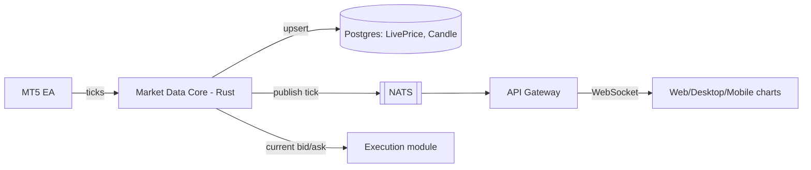

# Market Data Core

## 1. Today

A real MT5 EA (`mt5-ea/VyXTraderPriceFeed.mq5`) runs inside a broker's own
MT5 terminal and pushes live bid/ask ticks to
`app/api/internal/price-feed/[payload]` — a base64url-encoded path segment
(not a query string; an earlier debugging round found a network
intermediary stripping query strings entirely on the path the EA's
requests take, so the payload moved into the path itself as a workaround).
`lib/price-feed.ts` (`ingestTicks`) does the real work:

1. Auth via a shared secret compared against `PRICE_FEED_SECRET`.
2. Upserts `LivePrice` (latest bid/ask per symbol — one row per symbol,
   always current).
3. Upserts `Candle` for all 9 timeframes (`M1/M5/M30/H1/H4/D1/W1/MN1/Y1`)
   in the same transaction, using calendar-aware bucket boundaries for
   `W1`/`MN1`/`Y1` (weeks don't align to the Unix epoch at Monday, months
   and years aren't fixed-length) and fixed-millisecond floor-division for
   everything M1 through D1. High/low are widened via
   `GREATEST`/`LEAST` in the `ON CONFLICT` clause so a bucket's range
   stays correct across every tick that lands in it.

Symbols the EA doesn't cover (or brokers without an EA connected at all)
fall back to a client-side random-walk simulator
(`lib/market-simulator.ts`) — mirrors the same bucketing logic
independently on the client so the two data sources render identically
when a chart switches between real and simulated symbols. This dual-path
is an explicit, already-documented Phase-5 stopgap in the existing
codebase, not new information.

`app/api/trade/candles` serves chart history as a plain indexed
`Candle` select — no runtime aggregation over raw ticks, because the
aggregation already happened at ingest time.

## 2. Target: Rust Market Data Core

Absorbs `ingestTicks`'s logic essentially unchanged — the bucketing math
above is correct and stays; what moves is the process it runs in and who
else can consume it besides Postgres reads.

Two consumers that don't exist today: the Execution module (needs current
bid/ask synchronously for fills, see `execution.md`) and the NATS event
bus (so chart updates push over WebSocket instead of the current
client-side polling `WebTrader.tsx` does against `/api/trade/candles` and
`LivePrice`).

### 2.1 What changes vs. what doesn't

| | Today | Target |
|---|---|---|
| Tick ingest auth | Shared secret in URL path | Same shared-secret model carries forward; mTLS or a per-broker key is a Phase 3+ hardening item, not required for parity |
| Candle bucketing | `lib/price-feed.ts`, TypeScript | Same algorithm, ported to Rust — not redesigned |
| Fan-out to clients | Client polling | NATS publish → Gateway → WebSocket push |
| Fill-price source | N/A (Execution doesn't check price today) | Synchronous read by the Execution module |
| Simulator fallback | `lib/market-simulator.ts`, client-side | Stays client-side, unchanged — it's a rendering fallback for symbols with no real feed, not something the Rust core needs to know about |

## 3. Ownership boundary

Market Data Core is the sole writer of `LivePrice`/`Candle` (already true
today — nothing else writes these tables). No conflict with ADR-002's
OMS/`orders`/`positions` boundary; these are a separate table family
entirely.

## 4. Open questions for Phase 3

- Per-broker EA authentication (today's single global
  `PRICE_FEED_SECRET` doesn't distinguish which broker a tick came from —
  it's inferred from the symbol only) — fine at current scale, may need a
  per-broker key once more than a couple of EAs are live simultaneously.
- Tick-level history retention (only OHLC candles are persisted today,
  raw ticks are not) — revisit only if a future feature needs
  sub-candle-resolution replay; not needed for anything currently planned.

## 5. Implementation status

**Ingest — done.** `engine/market-data::db` has `upsert_live_price`/
`upsert_candle`, porting §1's SQL unchanged (including the `Timeframe::
Mn1` → Postgres `"MN1"` mapping quirk). `engine/market-data::ingest::
ingest_ticks` wraps both in one transaction per batch (matching the
original `prisma.$transaction`) and, only after commit, publishes each
tick to NATS on `price.tick.{symbol}` (best-effort — a broadcast failure
never rolls back or blocks a write that already succeeded, same rule as
`order_management::events`). `engine/server` exposes this as
`POST /internal/price-feed`, auth'd via an `x-price-feed-secret` header
(not the `[payload]/route.ts` base64-path scheme — that workaround is for
the network path between real MT5 terminals and Vercel, irrelevant to
this internal Next.js→Rust hop).

**Transport — unchanged for the EA, by design.** `lib/price-feed.ts`'s
`ingestTicks` no longer touches Prisma; it forwards the validated ticks to
the Rust route (`TRADING_CORE_URL`) and passes the response straight
through. Both existing route files
(`app/api/internal/price-feed/route.ts` and `.../[payload]/route.ts`)
are untouched — from the MT5 EA's point of view nothing changed. Repointing
an EA directly at the Rust service (skipping the Next.js hop) is a
deliberately separate, later cutover once that service has a stable
public deployment — not done here, to avoid any live-broker disruption.

**Fan-out — done for the first hop.** `services/api-gateway/src/ws.ts`
subscribes to `price.tick.*` on NATS once at startup and re-broadcasts
every message verbatim to every WebSocket client connected at
`/v1/prices/stream`. Auth is the same Redis-backed trader-session cookie
`requireTraderSession` checks for REST routes, minus that middleware's
`X-Broker-Id` cross-check — a browser's native `WebSocket` can't attach
custom headers, only cookies ride along automatically, and ticks are
broker-agnostic raw market data (§3), so "a valid trader session exists"
is the whole trust requirement here. `WebTrader.tsx` now opens this
socket and updates `liveTicksRef` on each message, landing ticks sooner
than the pre-existing 2s poll of `/api/trade/prices` — that poll is left
running as the connection-status indicator and as a fallback for any
environment where `NEXT_PUBLIC_GATEWAY_WS_URL` isn't set yet (i.e. hasn't
been cut over to the Gateway). Retiring the poll entirely is a later
cleanup once the WS path has proven itself live.

**Still open / explicitly not done in this slice:**
- The margin monitor (`order_management::monitor`) still polls Postgres
  every `MARGIN_MONITOR_INTERVAL_SECS` rather than reacting to the NATS
  tick stream this slice just added — a live stream now exists to drive
  it, but wiring the monitor off of it is separate follow-up work, not
  bundled into this slice.
- `db::get_live_price` (the synchronous read `docs/execution.md`'s
  Execution module will need) is implemented but not called from
  anywhere yet — Execution module integration is its own later slice.
- Per-broker EA auth and tick-level history retention (both listed above)
  are unaffected — still open, still deliberately deferred.
