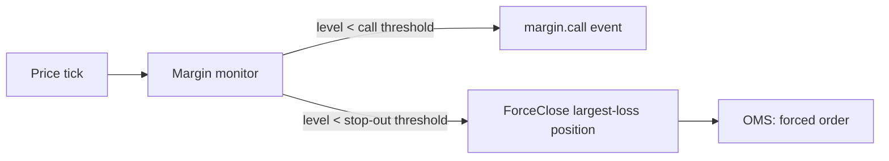

# Risk & Margin Engine

## 1. Today

There is no margin or risk enforcement in the current system at all.
`Account.leverage` (`Int`, default 100, meaning 1:100) exists on the
schema and is displayed to the trader, but nothing reads it to compute
required margin, nothing blocks an order for insufficient margin, and
there is no stop-out/margin-call logic anywhere in `lib/trading.ts`. An
account can currently be over-leveraged or negative-balance with no
system-level guard. This is a real gap, not a stopgap-by-design like the
market-data simulator — it's simply unbuilt.

## 2. Target: the Rust Risk/Margin module

Sits between OMS's `VALIDATING` state and `ACCEPTED` (see
`trading-engine.md` §2). Two responsibilities:

### 2.1 Pre-trade risk check (synchronous, blocks order acceptance)

For every incoming order:
1. Account status check (not `SUSPENDED`/`CLOSED` — mirrors the existing
   `AccountStatus` enum check already done in `lib/account-auth.ts`,
   just re-homed into the Rust core).
2. Symbol trading-enabled check (per-broker `BrokerSymbol` — already
   exists in Prisma, becomes a read-only reference table the Risk module
   loads/caches).
3. Required margin for this order = `volume * contract_size * price / leverage`
   (standard forex margin formula — `contract_size` comes from the
   `Symbol` spec, already in the schema).
4. Free margin check: `account.equity - account.used_margin >= required_margin`.
   Reject with `INSUFFICIENT_MARGIN` if not.
5. Per-broker exposure limits (max volume per symbol, max open positions
   per account) — new config, does not exist today; broker-configurable,
   defaults to "no limit" so existing demo brokers are unaffected until a
   broker admin sets one.

**Implementation status:** §2.2 below is implemented —
`engine/order-management::monitor`, polling on an interval rather than
literally per-tick (see `market-data.md`'s implementation status for
why), covering both the margin-call notification and the stop-out
force-close, including how a force-close's realized P&L is recorded
without violating `Account.balance`'s Prisma ownership (see
`architecture.md`'s Phase 2 log for the resolution).

### 2.2 Ongoing margin monitoring (async, runs continuously against live prices)

Not order-triggered — runs on every price tick from the Market Data Core
for every account with open positions:

- **Margin level** = `equity / used_margin * 100`.
- **Margin call** threshold (broker-configurable, sane default 100%):
  notify only, no forced action — publishes a `margin.call` event the
  Gateway pushes to the client as a warning toast.
- **Stop-out** threshold (broker-configurable, sane default 50%): Risk
  module tells OMS to force-close the account's largest-loss position(s)
  until margin level recovers above stop-out. This is the one place the
  Risk module directly triggers an order (`ForceClose`), rather than only
  gating one — documented as an explicit exception to "Risk only
  gates, never places."

## 3. Ownership boundary

Risk/Margin reads `orders`/`positions`/`accounts` state (owned by OMS and
the account/config tables respectively per ADR-002) but writes nothing
itself except its own audit trail of risk decisions (accept/reject
reasons, margin-call/stop-out events) — kept for compliance and support
dispute resolution, mirroring the existing `AuditLog` model's role today.

## 4. Open questions for Phase 2

- Whether margin-call/stop-out thresholds are broker-level config or
  per-account overridable — the current schema has no per-account
  override mechanism for anything risk-related; needs its own migration
  when this is actually built, not assumed here.
- Hedged-position margin treatment (netting vs gross) — current schema
  has no concept of hedging at all (one order → one position, 1:1); needs
  a decision before Phase 2 if the spec requires hedged accounts.

## 5. Implementation status

**§2.2 built, plus a gap this doc never flagged: per-position SL/TP
enforcement.** Neither this doc nor the pre-existing Next.js path
(`app/api/trade/*`) ever specified or implemented anything that actually
*closes* a position when price crosses the trader's own stop-loss/take-
profit — `lib/trading.ts`'s `validateSlTp` only checks a submitted SL/TP
is on the correct side of the entry price at order time, nothing ever
watched for it being *reached* afterward. A trader's "stop loss" was
cosmetic: the only thing that could force-close their position was
margin-ratio stop-out, an unrelated mechanism keyed to account equity,
not their chosen price level. `order_management::monitor` now checks
every open position's own SL/TP against the current tick first, before
the margin-level check runs (§2.2's flow above), and closes any that
crossed — independently per position, not "worst one only" like stop-out
— publishing `position.stop_loss_hit` / `position.take_profit_hit` NATS
events. Reuses `close_position_with_ledger_entry`'s idempotent close
(same protection against a double-close race as stop-out). Verified live
against a real Postgres: a BUY's SL and a SELL's TP both correctly
triggered and closed on the same tick, each with the correct realized
P&L; confirmed the tick-driven trigger (not just the polling-timer
fallback) actually fires this within about a second of the tick arriving
(round-trip latency to a remote Postgres, not a same-region deployment —
see `deployment.md`'s "network-adjacent to Postgres and NATS for
latency" note, this is exactly why that matters).
