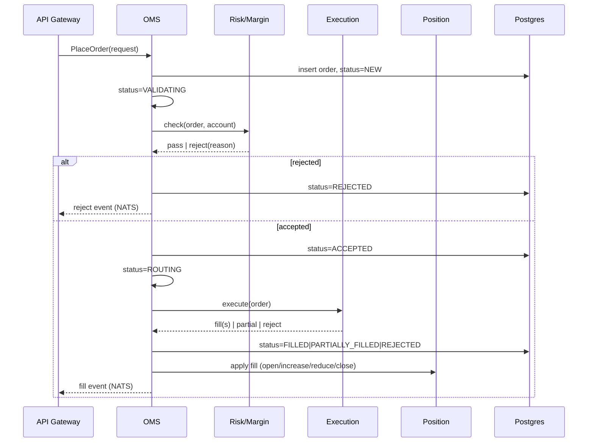

# Trading Engine (Rust Trading Core — Order Management)

Covers the OMS module of `/engine` (see `architecture.md` §3). Position,
Risk, Margin, and Execution are their own docs (`risk-engine.md`,
`execution.md`) — this one is the order lifecycle and the module boundary
around it.

**Implementation status:** the MARKET-order path in §2.1/§2.3 is
implemented — `engine/order-management::place_market_order` runs the full
NEW → VALIDATING → ACCEPTED|REJECTED → ROUTING → FILLED sequence in one
Postgres transaction, calling `risk::check_free_margin` and
`execution::execute_market_order`, publishing a NATS event after commit.
Not yet wired: anything that actually *calls* `place_market_order` — it's
a library function today, not exposed behind the API Gateway (`api.md`
§4 is still open), and the account/symbol figures it needs (equity,
used_margin, contract_size, leverage) are passed in by the caller rather
than fetched, since OMS doesn't own that Prisma data (ADR-002). LIMIT/STOP
orders, cancel/modify, and the position-application step beyond "insert
one position per fill" remain undone.

---

## 1. Today (Next.js/Prisma, unchanged until cutover)

Order placement lives in `app/api/trade/orders` calling into
`lib/trading.ts`. The current `OrderStatus` enum is a 5-state
simplification:

```
PENDING -> ACCEPTED -> FILLED
                     \-> REJECTED
PENDING -> CANCELLED
```

MARKET orders transition PENDING → FILLED in effectively one step,
trusting the client-supplied execution price — a documented stopgap
until a real matching/execution step exists. LIMIT/STOP orders sit in
PENDING until a price trigger or manual fill. This entire path keeps
running unmodified during the Rust core's build-out per ADR-003 — nothing
here changes until a broker is actually cut over.

## 2. Target: the Rust OMS module

The OMS owns exactly one thing: **order state**. It does not calculate
margin (Risk module), does not decide fill price (Execution module), and
does not maintain open-position P&L (Position module) — it orchestrates
calls to those modules and persists the result.



### 2.1 State machine

Full diagram already lives in `architecture.md` §5 — reproduced here as
the OMS module's authoritative contract:

`NEW → VALIDATING → ACCEPTED|REJECTED`, `ACCEPTED → ROUTING → PARTIALLY_FILLED|FILLED|REJECTED`,
`PARTIALLY_FILLED → FILLED|CANCELLED`, `ACCEPTED → CANCELLED|EXPIRED`.

Every transition is a single atomic write in the same Postgres
transaction as any resulting Position/Ledger mutation — no state is ever
inferred from two separate reads. This is the same discipline the current
Next.js code already follows via `$transaction`, just enforced at the
Rust type level instead of by convention (illegal transitions should not
compile, using a typestate or explicit match-exhaustiveness pattern
rather than a bare `status: OrderStatus` field mutated freely).

### 2.2 Order types (target)

`MARKET`, `LIMIT`, `STOP` carry forward unchanged from the current
`OrderType` enum. `STOP_LIMIT`, `TRAILING_STOP` are new, spec-required
additions with no equivalent today — flagged here as new work, not a
migration of existing behavior.

### 2.3 Module API (consumed by the API Gateway)

Synchronous request/response for placement/cancel/modify (order
acceptance must be confirmed before the Gateway acks the client);
asynchronous NATS events for everything downstream (fills, rejections,
expirations) so the Gateway can fan out over WebSocket without polling.

- `PlaceOrder(account_id, symbol, side, type, volume, price?, sl?, tp?) -> OrderAccepted | OrderRejected`
- `CancelOrder(order_id) -> Cancelled | CancelRejected(reason)`
- `ModifyOrder(order_id, sl?, tp?, price?) -> Modified | ModifyRejected(reason)`
- Events published: `order.accepted`, `order.rejected`, `order.filled`,
  `order.partially_filled`, `order.cancelled`, `order.expired`

## 3. Ownership boundary

Per ADR-002 (`decisions.md`): the OMS is the only writer of the `orders`
table in Postgres. The API Gateway and web app read order state via the
Gateway's query API (backed by the same Postgres, read path only) — they
never write `orders` directly once cutover happens for a given broker.
Until cutover, the existing Next.js `Order` table and this new one are
separate, broker-scoped: a broker is either fully on the old path or
fully on the new one, never split mid-flight.

## 4. Open questions for Phase 2

- Exact typestate encoding in Rust (enum-per-state vs single enum +
  exhaustive match) — an implementation detail, not an architectural one,
  left to Phase 2.
- Order expiry (GTC/GTD/IOC/FOK semantics) — spec mentions these but the
  current system has no time-in-force concept at all; needs its own
  design pass when Phase 2 starts, not assumed here.
